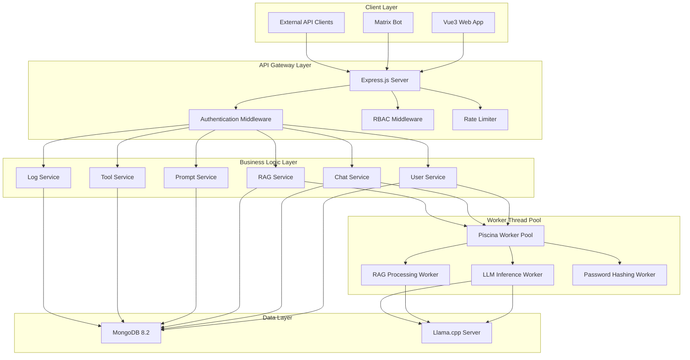
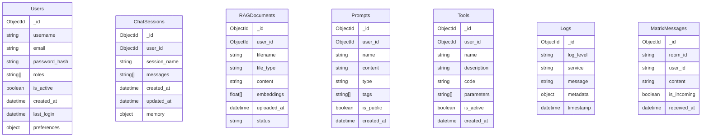
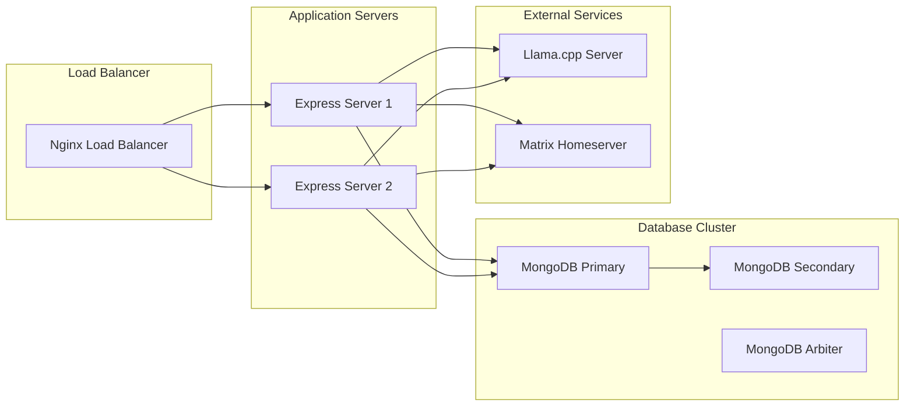

# Llama.cpp Chat System API Design

## Executive Summary

This document outlines the comprehensive API specification for a Llama.cpp-based chat system with user management, RAG capabilities, and tool support. The system integrates Node.js 24.12, Express.js, MongoDB 8.2, and Llama.cpp for inference.

---

## Architecture Overview



---

## Technical Stack

| Component | Version | Purpose |
|-----------|---------|---------|
| Node.js | 24.12 | Runtime environment |
| Express.js | Latest | Web framework |
| MongoDB | 8.2 | Primary database |
| Llama.cpp | Latest | LLM inference server |
| Argon2 | node-argon2 | Password hashing |
| Piscina | Latest | Worker thread pool |
| Vue3 | Latest | Frontend framework |

---

## Database Schema

### Collections



---

## API Specification

### Authentication & Authorization

#### POST `/api/auth/register`

Registers a new user account.

**Request Body:**
```json
{
  "username": "johndoe",
  "email": "john@example.com",
  "password": "SecurePassword123!"
}
```

**Response (201 Created):**
```json
{
  "success": true,
  "data": {
    "user_id": "60d5ec4f1234567890abcdef",
    "username": "johndoe",
    "email": "john@example.com",
    "roles": ["user"]
  }
}
```

**Error Responses:**
- 400: Invalid input
- 409: Username or email already exists

---

#### POST `/api/auth/login`

Authenticates a user and returns a JWT token.

**Request Body:**
```json
{
  "username": "johndoe",
  "password": "SecurePassword123!"
}
```

**Response (200 OK):**
```json
{
  "success": true,
  "data": {
    "token": "eyJhbGciOiJIUzI1NiIsInR5cCI6IkpXVCJ9...",
    "user": {
      "user_id": "60d5ec4f1234567890abcdef",
      "username": "johndoe",
      "email": "john@example.com",
      "roles": ["user"]
    }
  }
}
```

**Error Responses:**
- 401: Invalid credentials
- 403: Account inactive

---

#### POST `/api/auth/logout`

Invalidates the current session token.

**Headers:**
```
Authorization: Bearer <token>
```

**Response (200 OK):**
```json
{
  "success": true
}
```

---

#### PUT `/api/users/:id`

Updates user profile information.

**Request Body:**
```json
{
  "email": "newemail@example.com",
  "preferences": {
    "theme": "dark",
    "default_model": "llama-3-8b"
  }
}
```

**Response (200 OK):**
```json
{
  "success": true,
  "data": {
    "user_id": "60d5ec4f1234567890abcdef",
    "email": "newemail@example.com",
    "preferences": {
      "theme": "dark",
      "default_model": "llama-3-8b"
    }
  }
}
```

---

### User Management

#### GET `/api/users`

Lists all users (Admin only).

**Headers:**
```
Authorization: Bearer <token>
```

**Query Parameters:**
- `page`: Page number (default: 1)
- `limit`: Items per page (default: 20)
- `role`: Filter by role
- `active`: Filter by active status

**Response (200 OK):**
```json
{
  "success": true,
  "data": {
    "users": [
      {
        "user_id": "60d5ec4f1234567890abcdef",
        "username": "johndoe",
        "email": "john@example.com",
        "roles": ["user"],
        "is_active": true,
        "last_login": "2026-04-03T10:30:00Z"
      }
    ],
    "total": 1,
    "page": 1,
    "limit": 20
  }
}
```

---

#### DELETE `/api/users/:id`

Deletes a user account (Admin only).

**Response (200 OK):**
```json
{
  "success": true
}
```

---

### Chat Sessions

#### POST `/api/chats`

Creates a new chat session.

**Request Body:**
```json
{
  "session_name": "Project Discussion",
  "messages": [],
  "memory": {
    "context": [],
    "summary": ""
  }
}
```

**Response (201 Created):**
```json
{
  "success": true,
  "data": {
    "chat_id": "60d5ec4f1234567890abcdef",
    "session_name": "Project Discussion",
    "created_at": "2026-04-03T10:30:00Z"
  }
}
```

---

#### GET `/api/chats`

Lists all chat sessions for the current user.

**Response (200 OK):**
```json
{
  "success": true,
  "data": [
    {
      "chat_id": "60d5ec4f1234567890abcdef",
      "session_name": "Project Discussion",
      "last_message": "Hello",
      "updated_at": "2026-04-03T10:30:00Z"
    }
  ]
}
```

---

#### GET `/api/chats/:id`

Retrieves a specific chat session with messages.

**Response (200 OK):**
```json
{
  "success": true,
  "data": {
    "chat_id": "60d5ec4f1234567890abcdef",
    "session_name": "Project Discussion",
    "messages": [
      {
        "role": "user",
        "content": "Hello",
        "timestamp": "2026-04-03T10:30:00Z"
      },
      {
        "role": "assistant",
        "content": "Hi there! How can I help you?",
        "timestamp": "2026-04-03T10:30:05Z"
      }
    ],
    "memory": {
      "context": [],
      "summary": "User asked for greeting"
    }
  }
}
```

---

#### POST `/api/chats/:id/messages`

Sends a message to a chat session and returns LLM response.

**Request Body:**
```json
{
  "content": "Explain the RAG functionality",
  "model": "llama-3-8b"
}
```

**Response (200 OK):**
```json
{
  "success": true,
  "data": {
    "message_id": "msg_60d5ec4f1234567890abcdef",
    "role": "assistant",
    "content": "RAG (Retrieval-Augmented Generation) combines...",
    "timestamp": "2026-04-03T10:35:00Z",
    "tokens_used": 150,
    "context_used": [
      {
        "document_id": "doc_abc123",
        "content": "RAG retrieves relevant documents...",
        "score": 0.92
      }
    ]
  }
}
```

**Worker Thread Flow:**
1. Receive message in Express
2. Validate authentication
3. Fetch relevant documents for RAG
4. Spawn LlmWorker for inference
5. Return streaming response

---

#### PUT `/api/chats/:id/memory`

Updates chat memory (context and summary).

**Request Body:**
```json
{
  "context": [
    {
      "query": "previous question",
      "response": "previous answer"
    }
  ],
  "summary": "Discussion about API design patterns"
}
```

**Response (200 OK):**
```json
{
  "success": true
}
```

---

### RAG Operations

#### POST `/api/rag/documents`

Uploads a document for RAG processing.

**Request Body (multipart/form-data):**
```
file: <Binary File>
```

**Response (201 Created):**
```json
{
  "success": true,
  "data": {
    "document_id": "doc_60d5ec4f1234567890abcdef",
    "filename": "api_design.pdf",
    "file_type": "application/pdf",
    "status": "processing",
    "uploaded_at": "2026-04-03T10:40:00Z"
  }
}
```

**Processing Flow:**
1. Upload document
2. Spawn RagWorker for text extraction
3. Extract text and chunk content
4. Generate embeddings using Llama.cpp
5. Store in MongoDB

---

#### GET `/api/rag/documents`

Lists all documents for the current user.

**Response (200 OK):**
```json
{
  "success": true,
  "data": [
    {
      "document_id": "doc_60d5ec4f1234567890abcdef",
      "filename": "api_design.pdf",
      "file_type": "application/pdf",
      "status": "processed",
      "chunk_count": 45,
      "uploaded_at": "2026-04-03T10:40:00Z"
    }
  ]
}
```

---

#### DELETE `/api/rag/documents/:id`

Deletes a document and its embeddings.

**Response (200 OK):**
```json
{
  "success": true
}
```

---

#### POST `/api/rag/search`

Searches documents for relevant content.

**Request Body:**
```json
{
  "query": "authentication patterns",
  "top_k": 5,
  "min_score": 0.7
}
```

**Response (200 OK):**
```json
{
  "success": true,
  "data": [
    {
      "document_id": "doc_abc123",
      "content": "JWT tokens provide stateless authentication...",
      "score": 0.92,
      "chunk_index": 12
    },
    {
      "document_id": "doc_def456",
      "content": "OAuth2 is a standard for authorization...",
      "score": 0.85,
      "chunk_index": 8
    }
  ]
}
```

---

### Prompt Management

#### POST `/api/prompts`

Creates a new prompt template.

**Request Body:**
```json
{
  "name": "Code Review Prompt",
  "content": "Review the following code for:\n1. Performance issues\n2. Security vulnerabilities\n3. Best practices",
  "type": "code-review",
  "tags": ["review", "performance", "security"],
  "is_public": false
}
```

**Response (201 Created):**
```json
{
  "success": true,
  "data": {
    "prompt_id": "prompt_60d5ec4f1234567890abcdef",
    "name": "Code Review Prompt",
    "type": "code-review",
    "is_public": false,
    "created_at": "2026-04-03T10:50:00Z"
  }
}
```

---

#### GET `/api/prompts`

Lists all prompts for the current user.

**Response (200 OK):**
```json
{
  "success": true,
  "data": [
    {
      "prompt_id": "prompt_60d5ec4f1234567890abcdef",
      "name": "Code Review Prompt",
      "type": "code-review",
      "tags": ["review", "performance", "security"],
      "is_public": false,
      "created_at": "2026-04-03T10:50:00Z"
    }
  ]
}
```

---

#### GET `/api/prompts/:id`

Retrieves a prompt template.

**Response (200 OK):**
```json
{
  "success": true,
  "data": {
    "prompt_id": "prompt_60d5ec4f1234567890abcdef",
    "name": "Code Review Prompt",
    "content": "Review the following code for...",
    "type": "code-review",
    "tags": ["review", "performance", "security"],
    "is_public": false
  }
}
```

---

#### PUT `/api/prompts/:id`

Updates a prompt template.

**Response (200 OK):**
```json
{
  "success": true
}
```

---

### Tool Support

#### POST `/api/tools`

Creates a new tool (similar to Opencode).

**Request Body:**
```json
{
  "name": "File Search",
  "description": "Search for files in the project",
  "code": "const fs = require('fs');\nfunction searchFiles(pattern) {\n  return fs.readdirSync('./').filter(f => f.includes(pattern));\n}",
  "parameters": [
    {
      "name": "pattern",
      "type": "string",
      "required": true
    }
  ],
  "is_active": true
}
```

**Response (201 Created):**
```json
{
  "success": true,
  "data": {
    "tool_id": "tool_60d5ec4f1234567890abcdef",
    "name": "File Search",
    "description": "Search for files in the project",
    "is_active": true,
    "created_at": "2026-04-03T11:00:00Z"
  }
}
```

---

#### GET `/api/tools`

Lists all tools for the current user.

**Response (200 OK):**
```json
{
  "success": true,
  "data": [
    {
      "tool_id": "tool_60d5ec4f1234567890abcdef",
      "name": "File Search",
      "description": "Search for files in the project",
      "parameters": [{"name": "pattern", "type": "string", "required": true}],
      "is_active": true
    }
  ]
}
```

---

#### POST `/api/tools/:id/execute`

Executes a tool with provided parameters.

**Request Body:**
```json
{
  "pattern": "*.js"
}
```

**Response (200 OK):**
```json
{
  "success": true,
  "data": {
    "result": ["app.js", "config.js", "server.js"],
    "execution_time_ms": 15
  }
}
```

---

#### DELETE `/api/tools/:id`

Deletes a tool.

**Response (200 OK):**
```json
{
  "success": true
}
```

---

### Web Log Reader & System Monitor

#### GET `/api/logs`

Streams application logs.

**Query Parameters:**
- `level`: Log level filter (info, warn, error)
- `service`: Service name filter
- `since`: Start timestamp (ISO 8601)
- `limit`: Maximum records (default: 100)

**Response (200 OK):**
```json
{
  "success": true,
  "data": [
    {
      "log_id": "log_60d5ec4f1234567890abcdef",
      "level": "info",
      "service": "chat-service",
      "message": "Message processed successfully",
      "metadata": {
        "chat_id": "chat_abc123",
        "tokens": 150
      },
      "timestamp": "2026-04-03T10:30:00Z"
    }
  ]
}
```

---

#### GET `/api/monitor/health`

Returns system health status.

**Response (200 OK):**
```json
{
  "success": true,
  "data": {
    "status": "healthy",
    "timestamp": "2026-04-03T10:30:00Z",
    "uptime": 86400,
    "cpu_usage": 25.5,
    "memory_usage": 512,
    "database_connection": "connected",
    "llama_cpp_status": "running",
    "active_workers": 3
  }
}
```

---

#### GET `/api/monitor/performance`

Returns performance metrics.

**Response (200 OK):**
```json
{
  "success": true,
  "data": {
    "requests_per_second": 150,
    "average_response_time_ms": 245,
    "error_rate": 0.01,
    "worker_queue_length": 5,
    "database_queries_per_second": 50,
    "llama_inferences_per_second": 10
  }
}
```

---

### Matrix Bot Integration

#### POST `/api/matrix/messages`

Receives incoming Matrix messages.

**Request Body:**
```json
{
  "room_id": "!abc123:matrix.org",
  "sender": "@user:matrix.org",
  "content": "What is RAG?",
  "timestamp": "2026-04-03T10:30:00Z"
}
```

**Response (201 Created):**
```json
{
  "success": true,
  "data": {
    "message_id": "msg_mat_60d5ec4f1234567890abcdef",
    "auto_created_user": true,
    "response": "RAG (Retrieval-Augmented Generation)..."
  }
}
```

**Processing Flow:**
1. Receive Matrix message
2. Check if user exists (auto-create if not)
3. Create/update chat session for room
4. Process message through chat service
5. Send response back to Matrix

---

#### POST `/api/matrix/send`

Sends an outgoing Matrix message.

**Headers:**
```
Authorization: Bearer <token>
```

**Request Body:**
```json
{
  "room_id": "!abc123:matrix.org",
  "content": "Response to your query"
}
```

**Response (200 OK):**
```json
{
  "success": true,
  "data": {
    "message_id": "msg_mat_out_60d5ec4f1234567890abcdef"
  }
}
```

---

## Middleware Specification

### Authentication Middleware

Verifies JWT tokens and attaches user data to request.

```javascript
function authenticate(req, res, next) {
  const authHeader = req.headers.authorization;
  
  if (!authHeader) {
    return res.status(401).json({ error: 'No token provided' });
  }
  
  const token = authHeader.split(' ')[1];
  
  try {
    const decoded = jwt.verify(token, process.env.JWT_SECRET);
    req.user = decoded;
    next();
  } catch (err) {
    return res.status(401).json({ error: 'Invalid token' });
  }
}
```

---

### RBAC Middleware

Checks user roles and permissions.

```javascript
function authorize(allowedRoles) {
  return (req, res, next) => {
    if (!allowedRoles.some(role => req.user.roles.includes(role))) {
      return res.status(403).json({ error: 'Access denied' });
    }
    next();
  };
}
```

**Role Definitions:**
- `user`: Standard user (chat, RAG, prompts, tools)
- `admin`: Full access including user management
- `system`: System operations (monitoring, logs)

---

## Worker Thread Architecture

### Piscina Configuration

```javascript
const { Piscina } = require('piscina');

const piscina = new Piscina({
  filename: path.join(__dirname, 'worker.js'),
  maxThreads: 4,
  minThreads: 2,
  resourceLimits: {
    maxOldGenerationSizeMs: 2048,
    maxYoungGenerationSizeMs: 1024
  },
  workerData: {
    llamaServerUrl: 'http://localhost:8082'
  }
});
```

---

### Worker Implementation

```javascript
const { parentPort, workerData } = require('worker_threads');
const { exec } = require('child_process');

// LLM Inference Worker
async function llmInference(prompt, context, model) {
  const response = await fetch(`${workerData.llamaServerUrl}/v1/chat/completions`, {
    method: 'POST',
    headers: { 'Content-Type': 'application/json' },
    body: JSON.stringify({
      model: model,
      messages: [
        { role: 'system', content: context },
        { role: 'user', content: prompt }
      ],
      stream: false
    })
  });
  
  const data = await response.json();
  return data.choices[0].message.content;
}

// RAG Processing Worker
async function processRAG(fileBuffer) {
  // Extract text from file
  // Chunk content (1000 tokens per chunk)
  // Generate embeddings using Llama.cpp
  // Store in MongoDB
}

parentPort.on('message', async ({ type, data, requestId }) => {
  try {
    let result;
    
    switch (type) {
      case 'llm-inference':
        result = await llmInference(data.prompt, data.context, data.model);
        break;
      case 'rag-process':
        result = await processRAG(data.fileBuffer);
        break;
      case 'rag-search':
        result = await ragSearch(data.query, data.topK, data.minScore);
        break;
    }
    
    parentPort.postMessage({
      requestId,
      success: true,
      data: result
    });
  } catch (error) {
    parentPort.postMessage({
      requestId,
      success: false,
      error: error.message
    });
  }
});
```

---

## Security Considerations

### Password Hashing

Uses `node-argon2` with Argon2id:

```javascript
const argon2 = require('argon2');

async function hashPassword(password) {
  return await argon2.hash(password, {
    type: argon2.argon2id,
    memoryCost: 65536,
    timeCost: 3,
    parallelism: 1
  });
}

async function verifyPassword(password, hash) {
  return await argon2.verify(hash, password);
}
```

---

### Input Validation

All API endpoints validate input using `express-validator`:

```javascript
const { body, validationResult } = require('express-validator');

app.post('/api/auth/register', [
  body('username').isLength({ min: 3 }).escape(),
  body('email').isEmail().normalizeEmail(),
  body('password').isLength({ min: 12 }).matches(/[A-Z]/).matches(/[0-9]/)
], (req, res) => {
  const errors = validationResult(req);
  if (!errors.isEmpty()) {
    return res.status(400).json({ errors: errors.array() });
  }
  // Process registration
});
```

---

### Rate Limiting

```javascript
const rateLimit = require('express-rate-limit');

const apiLimiter = rateLimit({
  windowMs: 15 * 60 * 1000, // 15 minutes
  max: 100, // limit each IP to 100 requests per windowMs
  message: 'Too many requests from this IP, please try again later'
});

app.use('/api/', apiLimiter);
```

---

## Frontend Integration

### Vue3 Configuration

**Theme:** White with dark mint accent color (`#2d6a4f`)

**Main Components:**
- `ChatInterface.vue`: Interactive chat with streaming responses
- `DocumentManager.vue`: RAG document upload and search
- `PromptLibrary.vue`: Prompt template management
- `ToolBuilder.vue`: Tool creation and execution
- `SystemMonitor.vue`: Log viewer and performance metrics

**State Management:**
```javascript
// store/index.js
import { createStore } from 'vuex';

export default createStore({
  state() {
    return {
      user: null,
      token: null,
      chats: [],
      documents: [],
      prompts: [],
      tools: []
    };
  },
  mutations: {
    SET_USER(state, user) { state.user = user; },
    SET_TOKEN(state, token) { state.token = token; },
    ADD_CHAT(state, chat) { state.chats.push(chat); }
  },
  actions: {
    async login({ commit }, credentials) {
      const response = await axios.post('/api/auth/login', credentials);
      commit('SET_USER', response.data.data.user);
      commit('SET_TOKEN', response.data.data.token);
      return response.data;
    }
  }
});
```

---

## Deployment Architecture



---

## Monitoring & Logging

### Winston Configuration

```javascript
const { createLogger, format, transports } = require('winston');

const logger = createLogger({
  level: process.env.LOG_LEVEL || 'info',
  format: format.combine(
    format.timestamp(),
    format.json()
  ),
  transports: [
    new transports.Console(),
    new transports.File({ filename: 'logs/error.log', level: 'error' }),
    new transports.File({ filename: 'logs/combined.log' })
  ]
});
```

---

### Health Check Endpoint

```javascript
app.get('/api/health', async (req, res) => {
  const health = {
    status: 'healthy',
    timestamp: new Date().toISOString()
  };
  
  try {
    // Check MongoDB connection
    await db.admin().ping();
    health.database = 'connected';
    
    // Check Llama.cpp
    await fetch(`${LLAMA_SERVER_URL}/v1/models`);
    health.llama_cpp = 'running';
    
    res.json(health);
  } catch (error) {
    health.status = 'unhealthy';
    health.error = error.message;
    res.status(503).json(health);
  }
});
```

---

## Performance Optimization

### Database Indexing

```javascript
// Users collection
db.users.createIndex({ username: 1 }, { unique: true });
db.users.createIndex({ email: 1 }, { unique: true });

// Chat sessions
db.chatSessions.createIndex({ user_id: 1, updated_at: -1 });

// RAG documents
db.ragDocuments.createIndex({ user_id: 1 });
db.ragDocuments.createIndex({ status: 1 });

// Messages
db.messages.createIndex({ chat_id: 1, timestamp: 1 });

// Logs
db.logs.createIndex({ timestamp: -1 });
db.logs.createIndex({ service: 1 });
```

---

### Caching Strategy

```javascript
const Redis = require('ioredis');
const redis = new Redis(process.env.REDIS_URL);

// Cache chat session metadata
async function getChatSession(sessionId) {
  const cached = await redis.get(`chat:${sessionId}`);
  if (cached) return JSON.parse(cached);
  
  const session = await db.collection('chatSessions').findOne({ _id: sessionId });
  await redis.setex(`chat:${sessionId}`, 3600, JSON.stringify(session));
  return session;
}
```

---

## Future Enhancements

1. **Multi-tenant Support**: Organization-level user management
2. **Model Routing**: Select specific Llama.cpp models per request
3. **Advanced RAG**: Hybrid search with vector and full-text queries
4. **Real-time Collaboration**: Shared chat sessions with editing
5. **Analytics Dashboard**: Usage statistics and insights
6. **Mobile App**: Native iOS and Android clients
7. **Audio Integration**: Speech-to-text and text-to-speech
8. **Custom Fine-tuning**: User-specific model adaptation

---

## Conclusion

This comprehensive API specification provides a solid foundation for building a Llama.cpp-based chat system with full user management, RAG capabilities, tool support, and Matrix integration. The architecture prioritizes performance, security, and scalability while maintaining clean separation of concerns.
