# Architecture Overview

Deep dive into the LLM Assistance API architecture. Understand system components, data flow, and design decisions.

## System Architecture

The LLM Assistance API is a layered architecture built on Express.js with Playwright for browser automation. The system follows a session-based model where each operation occurs within an isolated browser context.

### High-Level Architecture

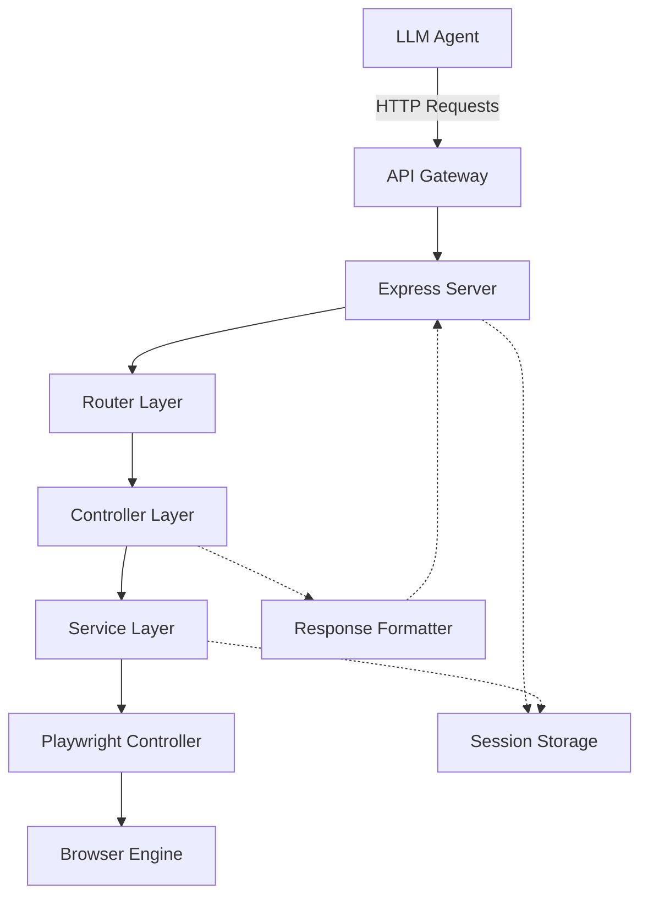

### Component Layers

| Layer           | Responsibility                          | Components           |
| --------------- | --------------------------------------- | -------------------- |
| **API Gateway** | Request routing, CORS, security headers | Express middleware   |
| **Router**      | Route definition, rate limiting         | Route handlers       |
| **Controller**  | Request parsing, response formatting    | Controller functions |
| **Service**     | Business logic, session management      | PlaywrightService    |
| **Browser**     | Browser automation                      | PlaywrightController |
| **Storage**     | Session state persistence               | SessionStorage       |

## Component Details

### Express Server

**Location:** `src/index.js`

**Responsibilities:**

- HTTP request handling
- Middleware configuration
- Route registration
- Error handling
- Server lifecycle management

**Key Configuration:**

```javascript
// Middleware
app.use(express.json());
app.use(cors({ origin: process.env.CORS_ORIGIN || "*" }));

// Rate limiting
const sessionLimiter = rateLimit({
  windowMs: 60000,
  max: 100,
  keyGenerator: (req) => req.params.id || "global",
});

// Security headers
app.use((req, res, next) => {
  res.set({
    "X-Content-Type-Options": "nosniff",
    "X-Frame-Options": "SAMEORIGIN",
    "X-XSS-Protection": "1; mode=block",
  });
  next();
});
```

### Session Storage

**Location:** `src/services/session/SessionStorage.js`

**Responsibilities:**

- Session lifecycle management
- In-memory session state
- Session metadata tracking
- Cleanup operations

**Data Model:**

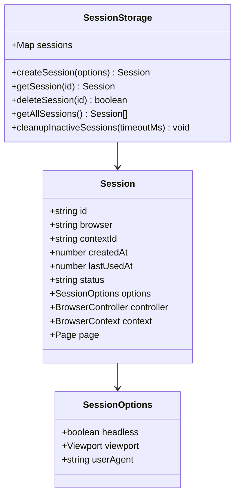

### Playwright Service

**Location:** `src/services/session/PlaywrightService.js`

**Responsibilities:**

- Browser lifecycle coordination
- Context and page creation
- Session-object attachment
- Resource cleanup

**Flow:**

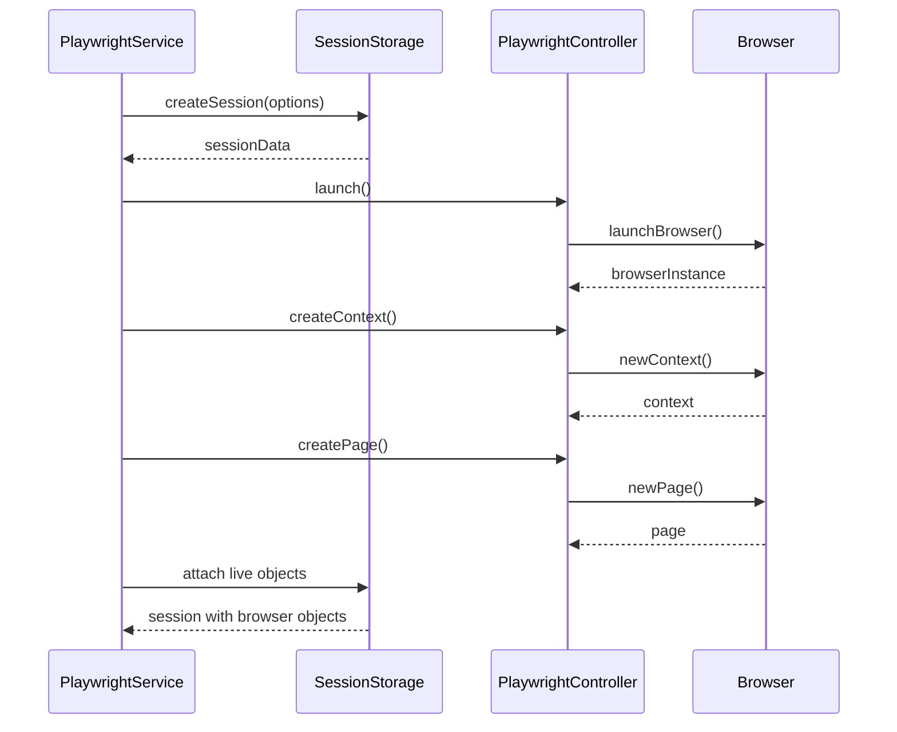

### Playwright Controller

**Location:** `src/controllers/playwright/PlaywrightController.js`

**Responsibilities:**

- Browser type selection (chromium, firefox, webkit)
- Browser instance management
- Context configuration
- Page creation
- Resource cleanup

**Browser Support:**

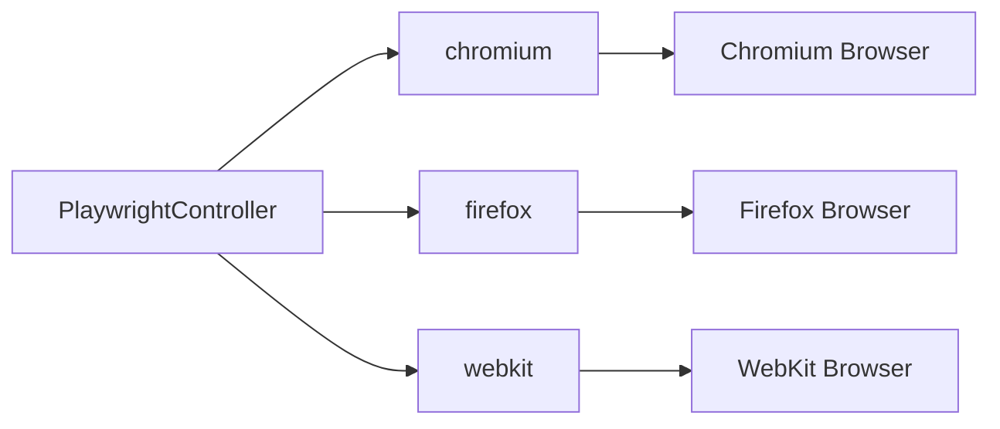

### Controllers

Each controller handles a specific domain of operations:

| Controller              | Location                                               | Operations                                      |
| ----------------------- | ------------------------------------------------------ | ----------------------------------------------- |
| `sessionController`     | `src/controllers/sessionController.js`                 | Create, get, delete sessions                    |
| `navigationController`  | `src/controllers/navigation/NavigationController.js`   | Navigate, back, forward, reload                 |
| `interactionController` | `src/controllers/interaction/InteractionController.js` | Click, type                                     |
| `extractionController`  | `src/controllers/extraction/ExtractionController.js`   | Screenshot, content, text, attributes, evaluate |
| `formController`        | `src/controllers/form/FormController.js`               | Fill form, select option, check, submit         |
| `advancedController`    | `src/controllers/advanced/AdvancedController.js`       | Wait for, set viewport, user agent, headers     |

## Data Flow

### Request Processing Flow

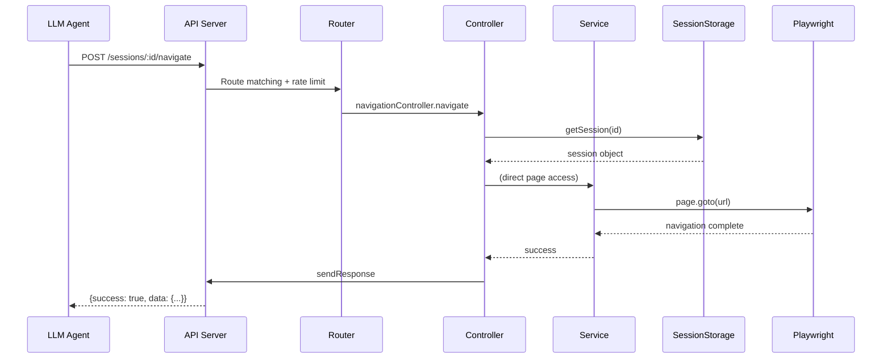

### Response Format Flow

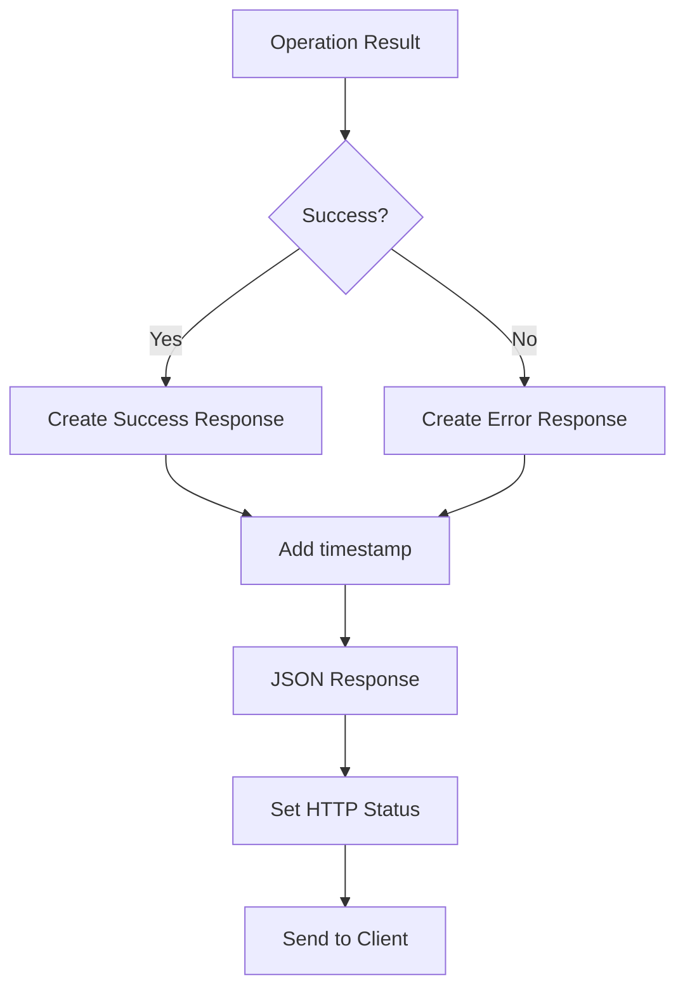

**Success Response:**

```json
{
  "success": true,
  "data": {
    /* operation result */
  },
  "timestamp": "2026-04-12T12:00:00.000Z"
}
```

**Error Response:**

```json
{
  "success": false,
  "error": "actionable error message",
  "timestamp": "2026-04-12T12:00:00.000Z"
}
```

## Session Architecture

### Session Isolation

Each session provides complete isolation:

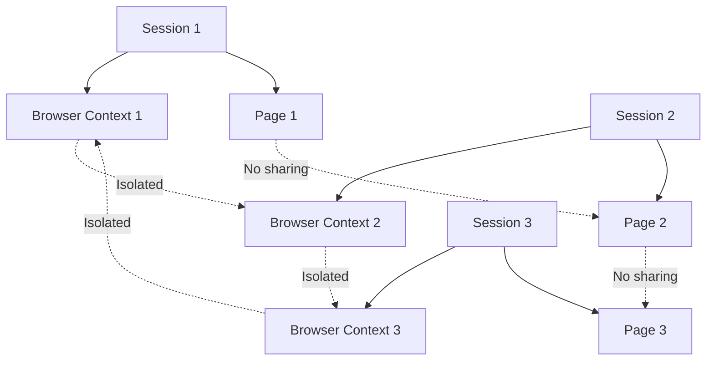

**Isolation Properties:**

- Separate cookie storage
- Independent DOM state
- Isolated JavaScript execution
- No shared localStorage/sessionStorage
- Independent network requests

### Session State Machine

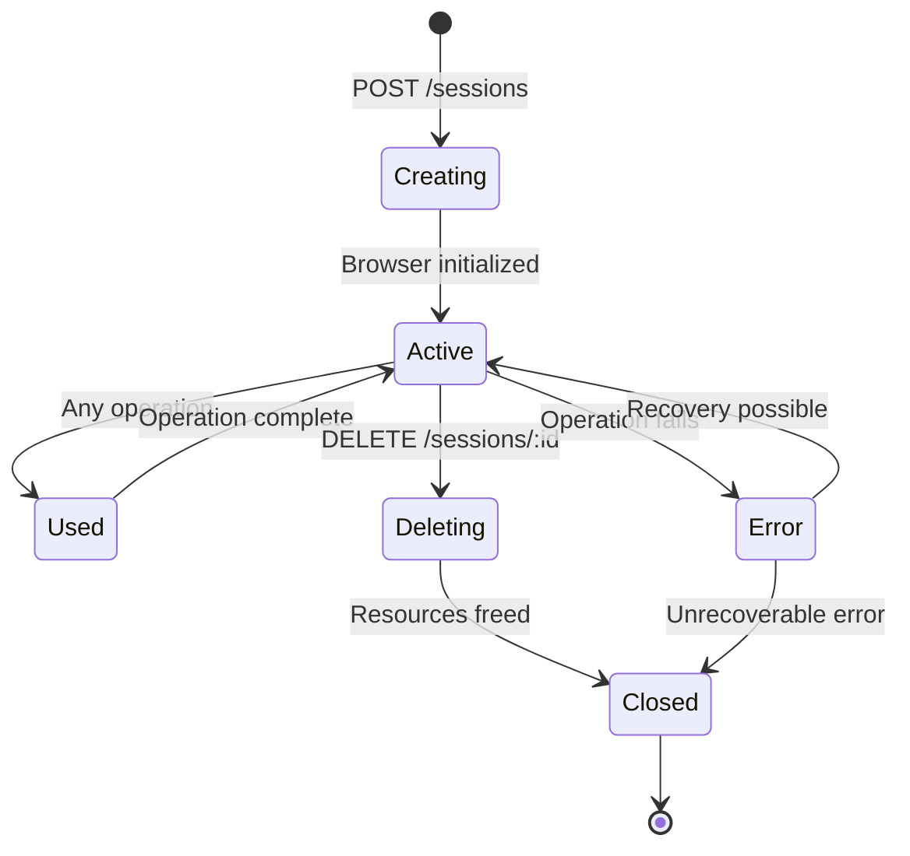

## Error Handling Architecture

### Error Propagation

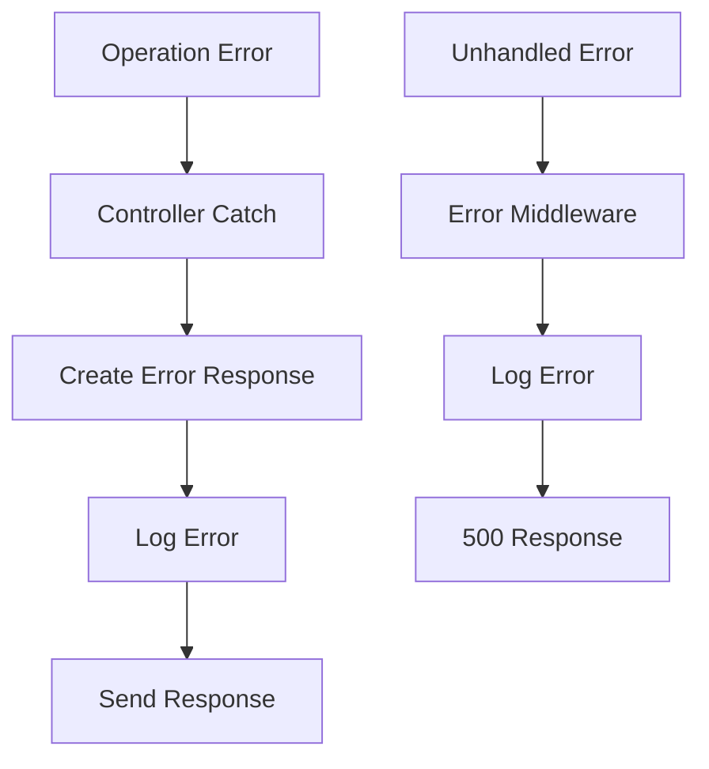

**Error Response Structure:**

| Component        | Purpose                           |
| ---------------- | --------------------------------- |
| `success: false` | Programmatic error detection      |
| `error`          | Human-readable actionable message |
| `timestamp`      | Debug and tracking                |
| HTTP status      | Standard error categorization     |

### Error Categories

| Status Code | Category     | Example                             |
| ----------- | ------------ | ----------------------------------- |
| 400         | Bad Request  | Invalid selector, missing parameter |
| 404         | Not Found    | Session not found                   |
| 408         | Timeout      | Wait condition timeout              |
| 429         | Rate Limit   | Too many requests                   |
| 500         | Server Error | JavaScript execution error          |

## Security Architecture

### Security Layers

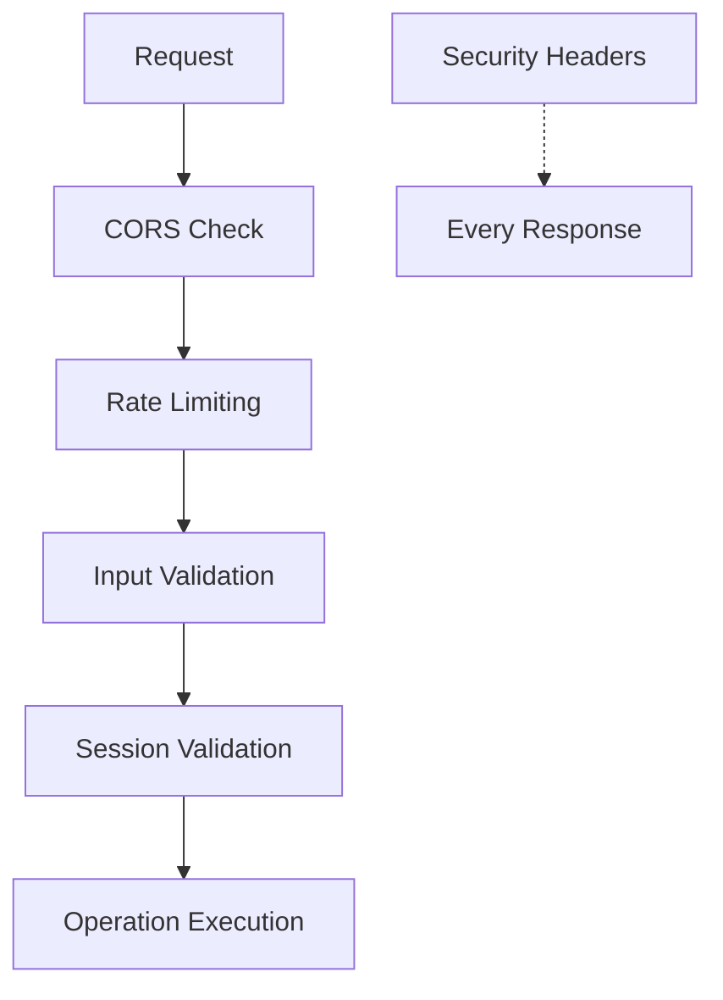

**Security Measures:**

| Layer                  | Implementation                                |
| ---------------------- | --------------------------------------------- |
| **CORS**               | Configurable origin whitelist                 |
| **Rate Limiting**      | 100 requests per 60 seconds per session       |
| **Input Sanitization** | Validation before operation                   |
| **Session Isolation**  | Complete context separation                   |
| **Security Headers**   | X-Frame-Options, X-Content-Type-Options, etc. |

### Rate Limiting Strategy

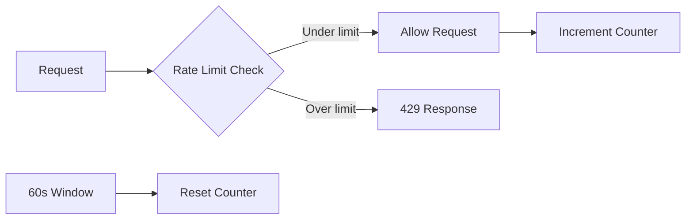

**Rate Limit Configuration:**

- Window: 60 seconds
- Max requests: 100 per session
- Key generator: Session ID or global fallback
- Response headers: X-RateLimit-Limit, X-RateLimit-Remaining, X-RateLimit-Reset

## Performance Architecture

### Resource Management

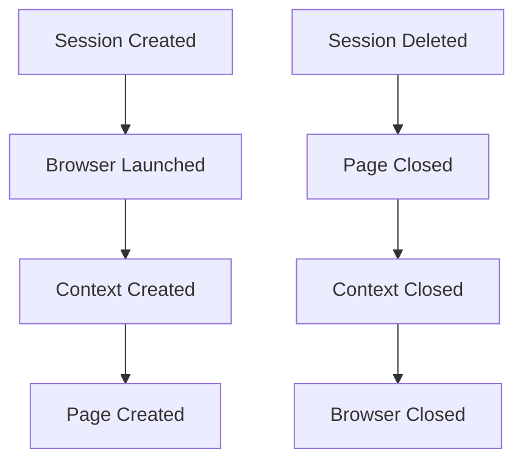

**Resource Cleanup:**

- Page closed on session deletion
- Context closed after page
- Browser closed after context
- Automatic error handling cleanup

### Concurrency Model

- Each session runs in isolated browser context
- Multiple sessions can run concurrently
- Browser instances are shared within same type
- Memory usage scales with concurrent sessions

## Technology Stack

| Component              | Technology               | Purpose                 |
| ---------------------- | ------------------------ | ----------------------- |
| **Server**             | Express.js 5.2.1         | HTTP server and routing |
| **Browser Automation** | Playwright 1.59.1        | Browser control         |
| **Session Storage**    | In-memory Map            | Session state           |
| **Rate Limiting**      | express-rate-limit 8.3.2 | Request throttling      |
| **CORS**               | cors 2.8.6               | Cross-origin requests   |
| **Documentation**      | swagger-ui-express 5.0.1 | API documentation       |
| **UUID Generation**    | uuid 9.0.1               | Session IDs             |

## File Structure

```
src/
├── index.js                    # Entry point
├── controllers/
│   ├── playwright/
│   │   └── PlaywrightController.js
│   ├── sessionController.js
│   ├── navigation/
│   │   └── NavigationController.js
│   ├── interaction/
│   │   └── InteractionController.js
│   ├── extraction/
│   │   └── ExtractionController.js
│   ├── form/
│   │   └── FormController.js
│   └── advanced/
│       └── AdvancedController.js
├── services/
│   └── session/
│       ├── SessionStorage.js
│       └── PlaywrightService.js
├── utils/
│   ├── response.js
│   └── sanitizer.js
├── tests/
│   ├── server.test.js
│   ├── session.test.js
│   ├── session_controller.test.js
│   ├── playwright_controller.test.js
│   ├── navigation.test.js
│   ├── interaction.test.js
│   ├── extraction.test.js
│   ├── form.test.js
│   ├── advanced.test.js
│   └── javascript.test.js
└── docs/
    ├── openapi.js              # OpenAPI specification
    └── examples/
        └── workflow-examples.js
```

## Deployment Architecture

### Docker Deployment

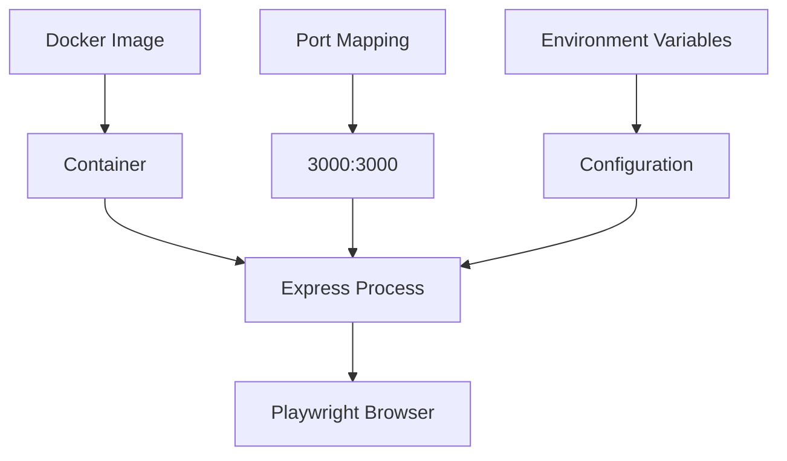

**Docker Configuration:**

- Base image: Node.js 24
- Port: 3000
- Environment variables for configuration
- Playwright browsers included in image

### Environment Configuration

| Variable      | Default  | Description          |
| ------------- | -------- | -------------------- |
| `PORT`        | 3000     | Server port          |
| `BROWSER`     | chromium | Default browser type |
| `HEADLESS`    | true     | Headless mode        |
| `CORS_ORIGIN` | \*       | Allowed CORS origins |

## Scalability Considerations

### Current Limitations

- **In-memory storage**: Sessions lost on restart
- **Single instance**: No horizontal scaling
- **Browser resources**: Memory intensive per session

### Future Enhancements

| Enhancement        | Benefit                         | Complexity |
| ------------------ | ------------------------------- | ---------- |
| Redis storage      | Persistence, horizontal scaling | Medium     |
| Multiple instances | Increased capacity              | High       |
| Browser pooling    | Resource efficiency             | High       |
| Queue system       | Request management              | Medium     |

## Monitoring and Observability

### Logging

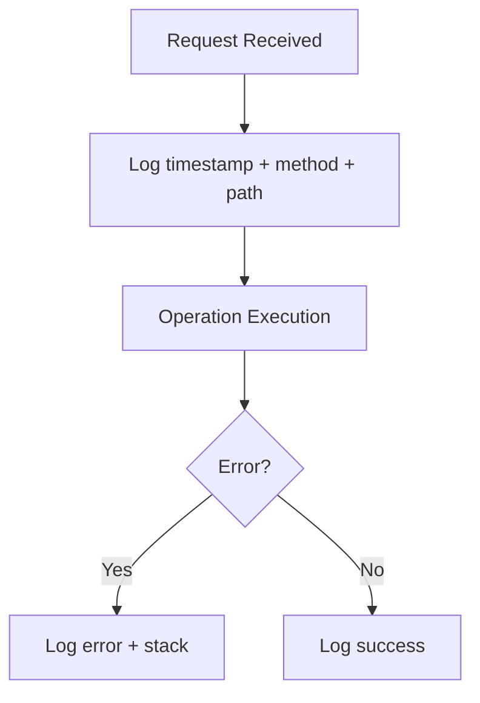

**Log Format:**

```
[2026-04-12T12:00:00.000Z] POST /sessions/:id/navigate
```

### Metrics to Track

- Active session count
- Request latency per endpoint
- Error rates by type
- Browser crash detection
- Rate limit hits

## Related Documentation

- [[features/session-management.md]] - Session operations
- [[technical/configuration.md]] - Environment settings
- [[technical/security.md]] - Security implementation
- [Design Document](../design_documents/design.md) - Original design specification

## Tags

`#architecture` `#system-design` `#components` `#data-flow` `#session-management` `#security` `#performance` `#scalability` `#technology-stack`
