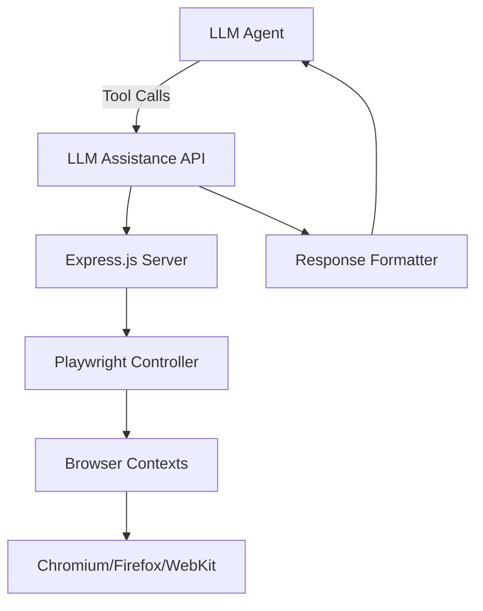
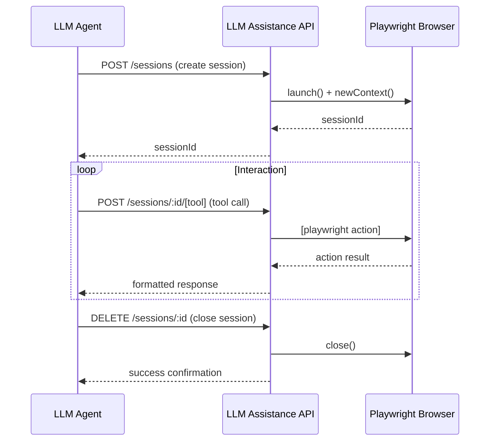

# LLM Assistance API Design Document

## Overview
This document describes the design of an LLM assistance API that enables Large Language Models to interact with web pages through Playwright automation via tool calling. The API provides capabilities for web research, screenshots, authentication, and DOM inspection.

## System Architecture



## Core Components

### 1. Express.js Server
- Handles HTTP requests from LLM agents
- Implements RESTful endpoints for tool calling
- Manages session state and authentication
- Provides error handling and logging

### 2. Playwright Controller
- Manages browser lifecycle (launch, context, pages)
- Executes browser automation commands
- Handles multiple concurrent sessions
- Implements cleanup and resource management

### 3. Tool Interface
- Defines available operations for LLM agents
- Maps tool names to Playwright actions
- Handles parameter validation and serialization
- Returns structured responses

## API Endpoints

### Session Management
- `POST /sessions` - Create new browser session
- `GET /sessions/:id` - Get session information
- `DELETE /sessions/:id` - Close browser session

### Navigation & Interaction
- `POST /sessions/:id/navigate` - Navigate to URL
- `POST /sessions/:id/click` - Click element
- `POST /sessions/:id/type` - Type text into element
- `POST /sessions/:id/screenshot` - Capture screenshot
- `POST /sessions/:id/execute` - Execute custom Playwright code

### Data Extraction
- `GET /sessions/:id/content` - Get page HTML
- `GET /sessions/:id/text` - Get page text content
- `GET /sessions/:id/attributes/:selector` - Get element attributes
- `POST /sessions/:id/evaluate` - Evaluate JavaScript and return result

### Form Handling
- `POST /sessions/:id/fill-form` - Fill form fields
- `POST /sessions/:id/select-option` - Select dropdown option
- `POST /sessions/:id/check` - Check/uncheck checkbox/radio

### Advanced Features
- `POST /sessions/:id/wait-for` - Wait for element/network event
- `POST /sessions/:id/set-viewport` - Set browser viewport
- `POST /sessions/:id/set-user-agent` - Set custom user agent
- `POST /sessions/:id/set-extra-headers` - Set additional HTTP headers

## Data Models

### Session Object
```json
{
  "id": "string",
  "browser": "chromium|firefox|webkit",
  "contextId": "string",
  "createdAt": "timestamp",
  "lastUsedAt": "timestamp",
  "status": "active|idle|closed",
  "options": {
    "headless": "boolean",
    "viewport": {"width": number, "height": number},
    "userAgent": "string"
  }
}
```

### Tool Response Format
```json
{
  "success": boolean,
  "data": any,
  "error": {
    "code": "string",
    "message": "string"
  } | null,
  "timestamp": "ISO string"
}
```

## Technical Requirements

### Dependencies
- Express.js v4.18+
- Playwright v1.40+ (latest)
- Node.js v24.12.0+

### Browser Support
- Chromium (default)
- Firefox
- WebKit

### Security Considerations
- Session isolation between LLM agents
- Input sanitization to prevent injection
- Rate limiting per session
- CORS configuration for controlled access
- Environment-based configuration for secrets

### Error Handling
- Standardized error responses
- HTTP status codes for different error types
- Detailed error messages for debugging
- Graceful cleanup on errors

## Implementation Phases

### Phase 1: Foundation
- Set up Express.js server
- Implement basic session management
- Create Playwright controller wrapper
- Define core API endpoints

### Phase 2: Core Functionality
- Implement navigation and interaction tools
- Add data extraction capabilities
- Create screenshot functionality
- Implement form handling

### Phase 3: Advanced Features
- Add waiting and synchronization tools
- Implement viewport and user agent controls
- Add network monitoring and mocking
- Create JavaScript execution capabilities

### Phase 4: Polish & Testing
- Add comprehensive error handling
- Implement logging and monitoring
- Create API documentation
- Perform load and stress testing

## Diagram: API Flow



## Configuration

### Environment Variables
- `PORT`: Server port (default: 3000)
- `NODE_ENV`: Environment (development/production)
- `MAX_SESSIONS`: Maximum concurrent sessions
- `SESSION_TIMEOUT`: Session idle timeout (ms)
- `HEADLESS`: Default headless mode (boolean)

### Default Settings
- Browser: Chromium
- Viewport: 1280x720
- Timeout: 30 seconds for actions
- Retry attempts: 3 for flaky operations

## Scalability Considerations

### Horizontal Scaling
- Stateless session storage (Redis optional)
- Load balancer support
- Containerization ready (Docker)

### Performance Optimizations
- Browser context reuse
- Connection pooling
- Efficient resource cleanup
- Asynchronous operation handling

## Monitoring & Observability

### Metrics
- Active session count
- Request latency
- Error rates
- Browser crash detection

### Logging
- Request/response logging
- Browser console capture
- Error stack traces
- Performance timing

## OpenAPI Specification Reference
The API will follow OpenAPI 3.0 specification for documentation and client generation.

## Future Enhancements
- File download/upload handling
- PDF generation capabilities
- Mobile device emulation
- Geolocation override
- Custom script injection