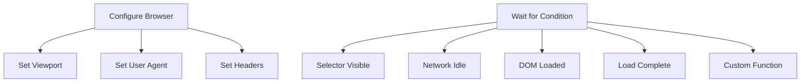
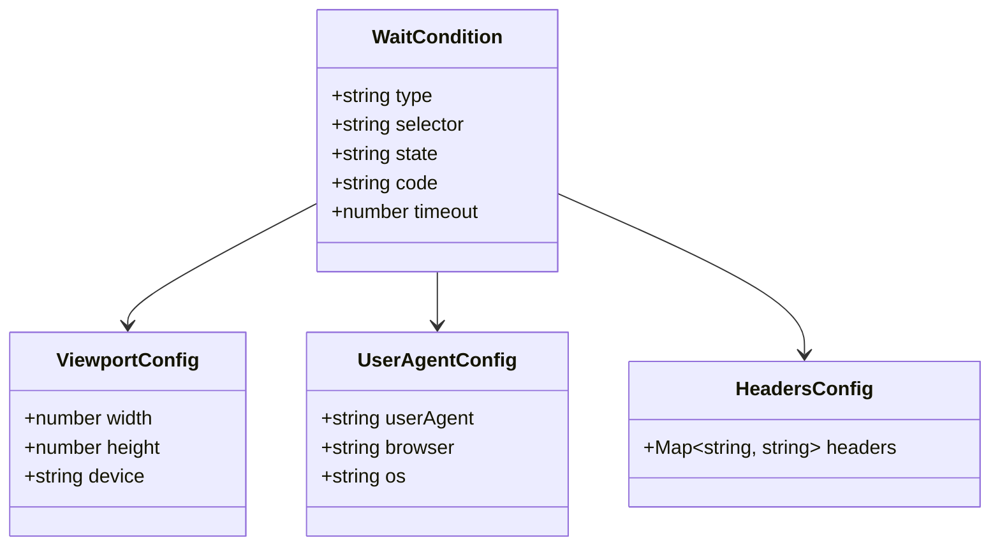

# Advanced Features

Advanced browser configuration and synchronization controls. Manage viewport, user agent, headers, and wait conditions for precise automation control.

## Overview

Advanced features provide fine-grained control over browser behavior and page loading. Use these operations to configure browser appearance, simulate different devices, manage network conditions, and synchronize with page state.

### Advanced Operations



## API Endpoints

### Wait For

Wait for a condition before proceeding with operations.

**Endpoint:** `POST /sessions/:id/wait-for`

**Request Body:**

```json
{
  "condition": {
    "type": "selector",
    "selector": ".product-loaded",
    "state": "visible"
  },
  "timeout": 30000
}
```

**Parameters:**

| Field       | Type   | Description                                        |
| ----------- | ------ | -------------------------------------------------- |
| `condition` | object | Wait condition configuration (required)            |
| `timeout`   | number | Maximum wait time in milliseconds (default: 30000) |

**Condition Types:**

| Type               | Required Fields | Optional Fields | Description                         |
| ------------------ | --------------- | --------------- | ----------------------------------- |
| `selector`         | selector        | state           | Wait for element to match selector  |
| `networkidle`      | -               | -               | Wait for network to be idle         |
| `domcontentloaded` | -               | -               | Wait for DOMContentLoaded event     |
| `load`             | -               | -               | Wait for load event                 |
| `function`         | code            | -               | Wait for custom JavaScript function |

**Condition State Options:**

| State      | Description                  |
| ---------- | ---------------------------- |
| `visible`  | Element is visible (default) |
| `hidden`   | Element is hidden            |
| `attached` | Element is attached to DOM   |
| `detached` | Element is detached from DOM |

**Response:**

```json
{
  "success": true,
  "data": {
    "condition": "selector"
  },
  "timestamp": "2026-04-12T12:00:00.000Z"
}
```

### Set Viewport

Configure browser viewport size and device emulation.

**Endpoint:** `POST /sessions/:id/set-viewport`

**Request Body:**

```json
{
  "width": 1280,
  "height": 720,
  "device": "iPhone 12"
}
```

**Parameters:**

| Field    | Type   | Default | Description                                     |
| -------- | ------ | ------- | ----------------------------------------------- |
| `width`  | number | -       | Viewport width in pixels                        |
| `height` | number | -       | Viewport height in pixels                       |
| `device` | string | null    | Predefined device name (overrides width/height) |

**Predefined Devices:**

| Device Name | Width | Height | User Agent |
| ----------- | ----- | ------ | ---------- |
| `iPhone 6`  | 375   | 667    | iPhone UA  |
| `iPhone 12` | 390   | 844    | iPhone UA  |
| `iPad`      | 768   | 1024   | iPad UA    |
| `Desktop`   | 1920  | 1080   | Desktop UA |

**Response:**

```json
{
  "success": true,
  "data": {
    "viewport": {
      "width": 390,
      "height": 844
    },
    "device": "iPhone 12"
  },
  "timestamp": "2026-04-12T12:00:00.000Z"
}
```

### Set User Agent

Configure the user agent string sent to servers.

**Endpoint:** `POST /sessions/:id/set-user-agent`

**Request Body:**

```json
{
  "userAgent": "Mozilla/5.0 (Windows NT 10.0; Win64; x64) Chrome/91.0"
}
```

**Parameters:**

| Field       | Type   | Description                         |
| ----------- | ------ | ----------------------------------- |
| `userAgent` | string | User agent string to use (required) |

**Response:**

```json
{
  "success": true,
  "data": {
    "userAgent": "Mozilla/5.0 (Windows NT 10.0; Win64; x64) Chrome/91.0"
  },
  "timestamp": "2026-04-12T12:00:00.000Z"
}
```

### Set Extra Headers

Add custom HTTP headers to requests.

**Endpoint:** `POST /sessions/:id/set-extra-headers`

**Request Body:**

```json
{
  "headers": {
    "X-Custom-Header": "custom-value",
    "Authorization": "Bearer token123"
  }
}
```

**Parameters:**

| Field     | Type   | Description                                           |
| --------- | ------ | ----------------------------------------------------- |
| `headers` | object | Key-value pairs of header names and values (required) |

**Response:**

```json
{
  "success": true,
  "data": {
    "headers": {
      "X-Custom-Header": "custom-value",
      "Authorization": "Bearer token123"
    }
  },
  "timestamp": "2026-04-12T12:00:00.000Z"
}
```

## Advanced Configuration Data Model



**Configuration Fields:**

| Field       | Type   | Description                                                             |
| ----------- | ------ | ----------------------------------------------------------------------- |
| `type`      | string | Condition type: selector, networkidle, domcontentloaded, load, function |
| `selector`  | string | CSS selector for element-based waits                                    |
| `state`     | string | Element state: visible, hidden, attached, detached                      |
| `code`      | string | JavaScript function for custom waits                                    |
| `timeout`   | number | Maximum wait time in milliseconds                                       |
| `width`     | number | Viewport width in pixels                                                |
| `height`    | number | Viewport height in pixels                                               |
| `device`    | string | Predefined device name                                                  |
| `userAgent` | string | User agent string                                                       |
| `headers`   | Map    | Custom HTTP headers                                                     |

## Usage Examples

### Wait for Element

```bash
# Wait for element to be visible
curl -X POST http://localhost:3000/sessions/SESSION_ID/wait-for \
  -H "Content-Type: application/json" \
  -d '{
    "condition": {
      "type": "selector",
      "selector": ".product-loaded",
      "state": "visible"
    },
    "timeout": 30000
  }'
```

### Wait for Network Idle

```bash
# Wait until network is idle
curl -X POST http://localhost:3000/sessions/SESSION_ID/wait-for \
  -H "Content-Type: application/json" \
  -d '{
    "condition": {
      "type": "networkidle"
    },
    "timeout": 60000
  }'
```

### Wait for Custom Function

```bash
# Wait until JavaScript condition is true
curl -X POST http://localhost:3000/sessions/SESSION_ID/wait-for \
  -H "Content-Type: application/json" \
  -d '{
    "condition": {
      "type": "function",
      "code": "() => document.querySelector(\\".data-loaded\\") !== null"
    },
    "timeout": 30000
  }'
```

### Set Mobile Viewport

```bash
# Use predefined iPhone 12 viewport
curl -X POST http://localhost:3000/sessions/SESSION_ID/set-viewport \
  -H "Content-Type: application/json" \
  -d '{"device": "iPhone 12"}'

# Use custom viewport dimensions
curl -X POST http://localhost:3000/sessions/SESSION_ID/set-viewport \
  -H "Content-Type: application/json" \
  -d '{"width": 1440, "height": 900}'
```

### Set User Agent for Mobile

```bash
# Simulate mobile browser
curl -X POST http://localhost:3000/sessions/SESSION_ID/set-user-agent \
  -H "Content-Type: application/json" \
  -d '{"userAgent": "Mozilla/5.0 (iPhone; CPU iPhone OS 14_0 like Mac OS X) AppleWebKit/605.1.15"}'
```

### Set Custom Headers

```bash
# Add custom headers for API requests
curl -X POST http://localhost:3000/sessions/SESSION_ID/set-extra-headers \
  -H "Content-Type: application/json" \
  -d '{
    "headers": {
      "X-API-Key": "your-api-key",
      "X-Custom-Header": "custom-value"
    }
  }'
```

### Complete Mobile Testing Workflow

```bash
# Step 1: Set mobile viewport
curl -X POST http://localhost:3000/sessions/SESSION_ID/set-viewport \
  -d '{"device": "iPhone 12"}'

# Step 2: Set mobile user agent
curl -X POST http://localhost:3000/sessions/SESSION_ID/set-user-agent \
  -d '{"userAgent": "Mozilla/5.0 (iPhone; CPU iPhone OS 14_0 like Mac OS X)"}'

# Step 3: Navigate to site
curl -X POST http://localhost:3000/sessions/SESSION_ID/navigate \
  -d '{"url": "https://example.com"}'

# Step 4: Wait for mobile-specific element
curl -X POST http://localhost:3000/sessions/SESSION_ID/wait-for \
  -d '{
    "condition": {
      "type": "selector",
      "selector": ".mobile-menu"
    }
  }'

# Step 5: Capture screenshot
curl -X POST http://localhost:3000/sessions/SESSION_ID/screenshot \
  -d '{"fullPage": true}' \
  --output mobile-screenshot.png
```

### Advanced Workflow Example

```bash
# Configure browser for testing
curl -X POST http://localhost:3000/sessions/SESSION_ID/set-viewport \
  -d '{"width": 1920, "height": 1080}'

# Navigate to page with dynamic content
curl -X POST http://localhost:3000/sessions/SESSION_ID/navigate \
  -d '{"url": "https://example.com/dashboard"}'

# Wait for loading to complete
curl -X POST http://localhost:3000/sessions/SESSION_ID/wait-for \
  -d '{"condition": {"type": "networkidle"}, "timeout": 60000}'

# Add authentication header
curl -X POST http://localhost:3000/sessions/SESSION_ID/set-extra-headers \
  -d '{"headers": {"Authorization": "Bearer token123"}}'

# Wait for dashboard data to load
curl -X POST http://localhost:3000/sessions/SESSION_ID/wait-for \
  -d '{
    "condition": {
      "type": "function",
      "code": "() => document.querySelector(\\".dashboard-data\\").children.length > 0"
    }
  }'

# Capture final state
curl -X POST http://localhost:3000/sessions/SESSION_ID/screenshot \
  -d '{"fullPage": true}' \
  --output dashboard.png
```

## Error Cases

**Wait Timeout (408):**

```json
{
  "success": false,
  "error": "Timeout waiting for condition: selector .product-loaded",
  "condition": "selector",
  "timestamp": "2026-04-12T12:00:00.000Z"
}
```

**Invalid Device (400):**

```json
{
  "success": false,
  "error": "Unknown device: Android",
  "timestamp": "2026-04-12T12:00:00.000Z"
}
```

**JavaScript Error in Wait Function (500):**

```json
{
  "success": false,
  "error": "ReferenceError: undefined is not a function",
  "condition": "function",
  "timestamp": "2026-04-12T12:00:00.000Z"
}
```

## Best Practices

### Wait Strategy

| Scenario                    | Recommended Condition        |
| --------------------------- | ---------------------------- |
| SPA with loading indicators | selector + visible state     |
| API-driven content          | networkidle                  |
| Initial page load           | domcontentloaded or load     |
| Dynamic content             | function with specific check |
| Complex async operations    | Multiple waits in sequence   |

### Viewport Configuration

1. **Use predefined devices** for common mobile testing
2. **Set viewport before navigation** for accurate rendering
3. **Combine with user agent** for complete device simulation
4. **Test responsive design** with multiple viewport sizes

### User Agent Strategy

1. **Match user agent to viewport** for consistent behavior
2. **Use realistic user agents** that match actual browsers
3. **Set before navigation** to ensure server receives correct UA
4. **Test content differences** based on user agent

### Header Management

1. **Set headers before navigation** for initial requests
2. **Include authentication** headers for protected resources
3. **Use custom headers** for API testing scenarios
4. **Clear headers** by setting empty object if needed

### Error Recovery

1. **Increase timeout** for slow-loading pages
2. **Verify selector** matches actual DOM structure
3. **Check function syntax** in custom wait conditions
4. **Use [[features/extraction.md]]** to verify page state

## Related Documentation

- [[features/navigation.md]] - Navigation with wait conditions
- [[features/advanced-features.md]] - Browser configuration
- [[qa/basic-workflows.md]] - Advanced workflow examples
- [[technical/configuration.md]] - Environment configuration

## Tags

`#advanced-features` `#wait-for` `#viewport` `#user-agent` `#headers` `#device-emulation` `#synchronization` `#timeout` `#configuration`
