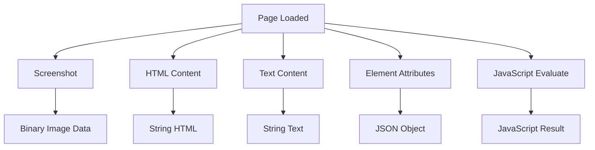
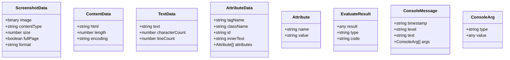

# Data Extraction

Extract content from web pages through screenshots, HTML, text, and element attributes. Capture visual and textual data for analysis.

## Overview

Data extraction operations enable you to capture page content in various formats. Use screenshots for visual verification, HTML for full structure analysis, text for content extraction, and attributes for specific element inspection.

### Extraction Methods



## API Endpoints

### Screenshot

Capture a screenshot of the current page.

**Endpoint:** `POST /sessions/:id/screenshot`

**Request Body:**

```json
{
  "fullPage": false,
  "type": "png",
  "quality": 100
}
```

**Parameters:**

| Field      | Type    | Default | Description                              |
| ---------- | ------- | ------- | ---------------------------------------- |
| `fullPage` | boolean | false   | Capture full scrollable page vs viewport |
| `type`     | string  | "png"   | Image format: png or jpeg                |
| `quality`  | number  | 100     | JPEG quality (1-100), not used for PNG   |

**Response:** Binary image data with headers:

```
Content-Type: image/png
Content-Length: 12345
```

**Screenshot Options:**

| Parameter  | Values      | Description                |
| ---------- | ----------- | -------------------------- |
| `type`     | png, jpeg   | Image format               |
| `fullPage` | true, false | Full page vs viewport only |
| `quality`  | 1-100       | JPEG compression quality   |

### Content

Get the full HTML content of the current page.

**Endpoint:** `GET /sessions/:id/content`

**Request Body:** None

**Response:**

```json
{
  "success": true,
  "data": {
    "content": "<!DOCTYPE html><html>...<body>...</body></html>"
  },
  "timestamp": "2026-04-12T12:00:00.000Z"
}
```

### Text

Extract visible text content from the page body.

**Endpoint:** `GET /sessions/:id/text`

**Request Body:** None

**Response:**

```json
{
  "success": true,
  "data": {
    "text": "Welcome to Example\n\nThis is paragraph text.\n\nLearn more about our services."
  },
  "timestamp": "2026-04-12T12:00:00.000Z"
}
```

### Attributes

Get attributes of a specific DOM element by CSS selector.

**Endpoint:** `GET /sessions/:id/attributes/:selector`

**Path Parameters:**

- `selector` - CSS selector for element (required)

**Request Body:** None

**Response:**

```json
{
  "success": true,
  "data": {
    "attributes": {
      "tagName": "INPUT",
      "className": "form-control email-input",
      "id": "email-field",
      "innerText": "",
      "attributes": [
        { "name": "type", "value": "email" },
        { "name": "name", "value": "email" },
        { "name": "placeholder", "value": "Enter email" }
      ]
    }
  },
  "timestamp": "2026-04-12T12:00:00.000Z"
}
```

**Attribute Fields:**

| Field        | Type   | Description                        |
| ------------ | ------ | ---------------------------------- |
| `tagName`    | string | HTML tag name (uppercase)          |
| `className`  | string | CSS class attribute value          |
| `id`         | string | ID attribute value (may be null)   |
| `innerText`  | string | Visible text content               |
| `attributes` | array  | All attributes as name/value pairs |

### Evaluate

Execute custom JavaScript code in the page context.

**Endpoint:** `POST /sessions/:id/evaluate`

**Request Body:**

```json
{
  "code": "document.title"
}
```

**Parameters:**

| Field  | Type   | Description                           |
| ------ | ------ | ------------------------------------- |
| `code` | string | JavaScript code to execute (required) |

**Response:**

```json
{
  "success": true,
  "data": {
    "result": "Example Domain",
    "type": "string",
    "code": "document.title"
  },
  "timestamp": "2026-04-12T12:00:00.000Z"
}
```

### Add Init Script

Execute JavaScript on every page load before other scripts.

**Endpoint:** `POST /sessions/:id/add-init-script`

**Request Body:**

```json
{
  "code": "console.log('Init script loaded')"
}
```

**Parameters:**

| Field  | Type   | Description                          |
| ------ | ------ | ------------------------------------ |
| `code` | string | JavaScript code to inject (required) |

**Response:**

```json
{
  "success": true,
  "data": {},
  "timestamp": "2026-04-12T12:00:00.000Z"
}
```

### Console Messages

Capture console messages from the page.

**Endpoint:** `GET /sessions/:id/console-messages`

**Query Parameters:**

- `level` - Filter by console level: log, info, warn, error (optional)

**Response:**

```json
{
  "success": true,
  "data": {
    "messages": [
      {
        "timestamp": "2026-04-12T12:00:00.000Z",
        "level": "log",
        "text": "Page loaded successfully",
        "args": [
          {
            "type": "string",
            "value": "Page loaded successfully"
          }
        ]
      },
      {
        "timestamp": "2026-04-12T12:00:01.000Z",
        "level": "error",
        "text": "Failed to load resource",
        "args": [
          {
            "type": "string",
            "value": "https://cdn.example.com/script.js"
          }
        ]
      }
    ]
  },
  "timestamp": "2026-04-12T12:00:02.000Z"
}
```

**Console Message Fields:**

| Field       | Type   | Description                                  |
| ----------- | ------ | -------------------------------------------- |
| `timestamp` | string | ISO timestamp of message                     |
| `level`     | string | Console level: log, info, warn, error, debug |
| `text`      | string | Console message text                         |
| `args`      | array  | Additional arguments passed to console       |

## Extraction Data Model



## Usage Examples

### Basic Screenshot

```bash
# Capture viewport screenshot as PNG
curl -X POST http://localhost:3000/sessions/SESSION_ID/screenshot \
  -H "Content-Type: application/json" \
  -d '{"type": "png", "fullPage": false}' \
  --output screenshot.png
```

### Full Page Screenshot with JPEG

```bash
# Capture full page as compressed JPEG
curl -X POST http://localhost:3000/sessions/SESSION_ID/screenshot \
  -H "Content-Type: application/json" \
  -d '{"type": "jpeg", "fullPage": true, "quality": 80}' \
  --output fullpage.jpg
```

### Extract Page Content

```bash
# Get HTML content
curl http://localhost:3000/sessions/SESSION_ID/content

# Get text content only
curl http://localhost:3000/sessions/SESSION_ID/text
```

### Inspect Element Attributes

```bash
# Get input field attributes
curl http://localhost:3000/sessions/SESSION_ID/attributes/input[name=\"email\"]

# Get button attributes
curl http://localhost:3000/sessions/SESSION_ID/attributes/button[type=\"submit\"]
```

### Execute JavaScript

```bash
# Get page title
curl -X POST http://localhost:3000/sessions/SESSION_ID/evaluate \
  -H "Content-Type: application/json" \
  -d '{"code": "document.title"}'

# Extract all links
curl -X POST http://localhost:3000/sessions/SESSION_ID/evaluate \
  -H "Content-Type: application/json" \
  -d '{"code": "[...document.querySelectorAll(\\"a\\")].map(a => a.href)"}'

# Check if element exists
curl -X POST http://localhost:3000/sessions/SESSION_ID/evaluate \
  -H "Content-Type: application/json" \
  -d '{"code": "document.querySelector(\\".product-card\\") !== null"}'
```

### Capture Console Messages

```bash
# Get all console messages
curl http://localhost:3000/sessions/SESSION_ID/console-messages

# Get only error messages
curl http://localhost:3000/sessions/SESSION_ID/console-messages?level=error

# Get warning messages
curl http://localhost:3000/sessions/SESSION_ID/console-messages?level=warn
```

### Complete Extraction Workflow

```bash
# Step 1: Navigate to page
curl -X POST http://localhost:3000/sessions/SESSION_ID/navigate \
  -d '{"url": "https://example.com"}'

# Step 2: Capture screenshot
curl -X POST http://localhost:3000/sessions/SESSION_ID/screenshot \
  -d '{"fullPage": true}' \
  --output page.png

# Step 3: Extract content
curl http://localhost:3000/sessions/SESSION_ID/content > page.html

# Step 4: Extract text
curl http://localhost:3000/sessions/SESSION_ID/text > page.txt

# Step 5: Evaluate for specific data
curl -X POST http://localhost:3000/sessions/SESSION_ID/evaluate \
  -d '{"code": "document.querySelector(\\"h1\\").innerText"}'
```

## Error Cases

**Element Not Found (400):**

```json
{
  "success": false,
  "error": "Could not find element with selector '.nonexistent'",
  "timestamp": "2026-04-12T12:00:00.000Z"
}
```

**JavaScript Error (500):**

```json
{
  "success": false,
  "error": "TypeError: Cannot read property 'length' of undefined",
  "code": "document.querySelector('.items').length",
  "stack": "TypeError: ...\n    at evaluate...",
  "timestamp": "2026-04-12T12:00:00.000Z"
}
```

**Invalid Screenshot Type (400):**

```json
{
  "success": false,
  "error": "Invalid screenshot type: gif",
  "timestamp": "2026-04-12T12:00:00.000Z"
}
```

## Best Practices

### Screenshot Strategy

1. **Use fullPage: false** for faster captures of viewport
2. **Use JPEG with quality < 100** for smaller file sizes
3. **Use PNG** for text-heavy pages (better clarity)
4. **Capture after navigation completes** to avoid partial renders

### Content Extraction

1. **Use text endpoint** for content analysis (no HTML noise)
2. **Use content endpoint** for full structure inspection
3. **Use attributes endpoint** for specific element data
4. **Combine with evaluate** for complex data extraction

### JavaScript Evaluation

1. **Keep code simple** and focused on single task
2. **Handle errors gracefully** in evaluated code
3. **Return structured data** (objects, arrays) when possible
4. **Use for dynamic content** that requires JavaScript rendering

### Console Message Capture

1. **Filter by level** to reduce noise (error, warn)
2. **Capture after navigation** to get load-time messages
3. **Add init scripts** to inject custom logging
4. **Use for debugging** page issues and errors

## Related Documentation

- [[features/navigation.md]] - Navigate before extraction
- [[features/javascript-execution.md]] - Advanced JavaScript operations
- [[qa/research-task.md]] - Extraction in research workflows
- [[technical/api-reference.md]] - Complete API reference

## Tags

`#extraction` `#screenshot` `#html` `#text` `#attributes` `#javascript` `#console` `#data-capture` `#page-analysis`
