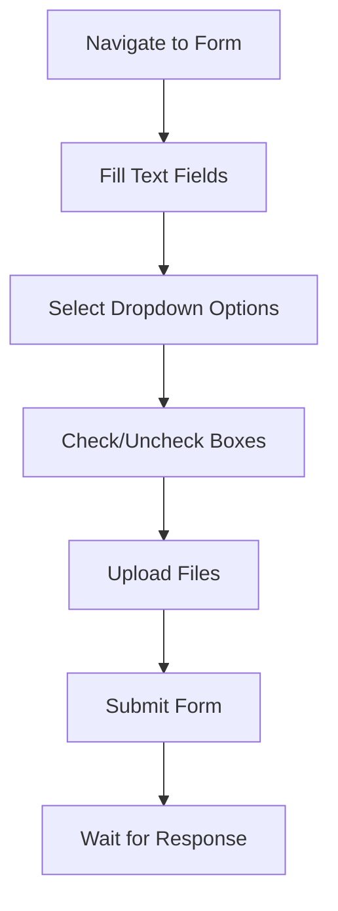
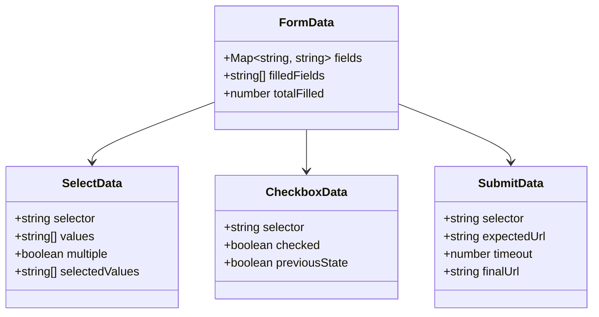

# Form Handling

Fill and submit HTML forms programmatically. Handle text inputs, file uploads, dropdowns, checkboxes, and form submission.

## Overview

Form handling operations enable complete form automation including filling fields, selecting options, toggling checkboxes, and submitting forms. All form operations work within the current session context.

### Form Workflow



## API Endpoints

### Fill Form

Fill multiple form fields at once.

**Endpoint:** `POST /sessions/:id/fill-form`

**Request Body:**

```json
{
  "fields": {
    "username": "johndoe",
    "email": "john@example.com",
    "message": "Hello world",
    "avatar.file": "/path/to/avatar.jpg"
  }
}
```

**Parameters:**

| Field    | Type   | Description                                          |
| -------- | ------ | ---------------------------------------------------- |
| `fields` | object | Key-value pairs of field names and values (required) |

**Field Naming Convention:**

| Pattern       | Target                       | Example                              |
| ------------- | ---------------------------- | ------------------------------------ |
| `[name]`      | Text input, textarea, select | `"email": "test@example.com"`        |
| `[name].file` | File input                   | `"avatar.file": "/path/to/file.jpg"` |

**Response:**

```json
{
  "success": true,
  "data": {
    "filled": 3
  },
  "timestamp": "2026-04-12T12:00:00.000Z"
}
```

### Select Option

Select option(s) from a dropdown select element.

**Endpoint:** `POST /sessions/:id/select-option`

**Request Body:**

```json
{
  "selector": "select[name='country']",
  "value": "US",
  "multiple": false
}
```

**Parameters:**

| Field      | Type    | Default    | Description                            |
| ---------- | ------- | ---------- | -------------------------------------- | ------------------------- |
| `selector` | string  | (required) | CSS selector for select element        |
| `value`    | string  | string[]   | (required)                             | Option value(s) to select |
| `multiple` | boolean | false      | Whether select allows multiple options |

**Response:**

```json
{
  "success": true,
  "data": {
    "selected": "US"
  },
  "timestamp": "2026-04-12T12:00:00.000Z"
}
```

### Check

Check or uncheck a checkbox or radio button.

**Endpoint:** `POST /sessions/:id/check`

**Request Body:**

```json
{
  "selector": "input[name='newsletter']",
  "checked": true
}
```

**Parameters:**

| Field      | Type    | Default    | Description                     |
| ---------- | ------- | ---------- | ------------------------------- |
| `selector` | string  | (required) | CSS selector for checkbox/radio |
| `checked`  | boolean | true       | True to check, false to uncheck |

**Response:**

```json
{
  "success": true,
  "data": {
    "checked": true
  },
  "timestamp": "2026-04-12T12:00:00.000Z"
}
```

### Submit Form

Click the form submit button and optionally wait for navigation.

**Endpoint:** `POST /sessions/:id/submit-form`

**Request Body:**

```json
{
  "selector": "form",
  "url": "https://example.com/success",
  "timeout": 10000
}
```

**Parameters:**

| Field      | Type   | Default | Description                              |
| ---------- | ------ | ------- | ---------------------------------------- |
| `selector` | string | "form"  | CSS selector for form or submit button   |
| `url`      | string | null    | Expected URL after submission (optional) |
| `timeout`  | number | 10000   | Timeout for URL wait in milliseconds     |

**Response:**

```json
{
  "success": true,
  "data": {
    "url": "https://example.com/success"
  },
  "timestamp": "2026-04-12T12:00:00.000Z"
}
```

## Form Data Model



**Form State:**

| Field            | Type     | Description                             |
| ---------------- | -------- | --------------------------------------- |
| `fields`         | Map      | Form field name to value mapping        |
| `filledFields`   | string[] | List of successfully filled field names |
| `totalFilled`    | number   | Count of filled fields                  |
| `selectedValues` | string[] | Selected option values for dropdowns    |
| `checked`        | boolean  | Checkbox/radio checked state            |
| `finalUrl`       | string   | URL after form submission               |

## Usage Examples

### Basic Form Fill

```bash
# Fill a simple registration form
curl -X POST http://localhost:3000/sessions/SESSION_ID/fill-form \
  -H "Content-Type: application/json" \
  -d '{
    "fields": {
      "username": "johndoe",
      "email": "john@example.com",
      "password": "securepass123"
    }
  }'
```

### Form with File Upload

```bash
# Fill form with file upload
curl -X POST http://localhost:3000/sessions/SESSION_ID/fill-form \
  -H "Content-Type: application/json" \
  -d '{
    "fields": {
      "name": "John Doe",
      "email": "john@example.com",
      "resume.file": "/documents/resume.pdf"
    }
  }'
```

### Dropdown Selection

```bash
# Select single option from dropdown
curl -X POST http://localhost:3000/sessions/SESSION_ID/select-option \
  -H "Content-Type: application/json" \
  -d '{
    "selector": "select[name=\"country\"]",
    "value": "US"
  }'

# Select multiple options
curl -X POST http://localhost:3000/sessions/SESSION_ID/select-option \
  -H "Content-Type: application/json" \
  -d '{
    "selector": "select[name=\"skills\"]",
    "value": ["javascript", "python"],
    "multiple": true
  }'
```

### Checkbox Handling

```bash
# Check a checkbox
curl -X POST http://localhost:3000/sessions/SESSION_ID/check \
  -H "Content-Type: application/json" \
  -d '{
    "selector": "input[name=\"terms\"]",
    "checked": true
  }'

# Uncheck a checkbox
curl -X POST http://localhost:3000/sessions/SESSION_ID/check \
  -H "Content-Type: application/json" \
  -d '{
    "selector": "input[name=\"newsletter\"]",
    "checked": false
  }'
```

### Complete Form Submission Workflow

```bash
# Step 1: Navigate to form page
curl -X POST http://localhost:3000/sessions/SESSION_ID/navigate \
  -d '{"url": "https://example.com/contact"}'

# Step 2: Fill text fields
curl -X POST http://localhost:3000/sessions/SESSION_ID/fill-form \
  -d '{
    "fields": {
      "name": "John Doe",
      "email": "john@example.com",
      "subject": " Inquiry"
    }
  }'

# Step 3: Select dropdown option
curl -X POST http://localhost:3000/sessions/SESSION_ID/select-option \
  -d '{"selector": "select[name=\"department\"]", "value": "sales"}'

# Step 4: Check terms checkbox
curl -X POST http://localhost:3000/sessions/SESSION_ID/check \
  -d '{"selector": "input[name=\"terms\"]", "checked": true}'

# Step 5: Submit form and wait for success page
curl -X POST http://localhost:3000/sessions/SESSION_ID/submit-form \
  -d '{
    "selector": "button[type=\"submit\"]",
    "url": "https://example.com/thank-you",
    "timeout": 15000
  }'
```

### Complex Form with Multiple Field Types

```bash
# Complete multi-type form
curl -X POST http://localhost:3000/sessions/SESSION_ID/fill-form \
  -H "Content-Type: application/json" \
  -d '{
    "fields": {
      "firstName": "John",
      "lastName": "Doe",
      "email": "john@example.com",
      "phone": "+1-555-123-4567",
      "bio": "Software developer with 10 years experience",
      "profile.photo.file": "/images/profile.jpg"
    }
  }'

# Select multiple dropdowns
curl -X POST http://localhost:3000/sessions/SESSION_ID/select-option \
  -d '{"selector": "select[name=\"country\"]", "value": "US"}'

curl -X POST http://localhost:3000/sessions/SESSION_ID/select-option \
  -d '{"selector": "select[name=\"timezone\"]", "value": "America/New_York"}'

# Check multiple checkboxes
curl -X POST http://localhost:3000/sessions/SESSION_ID/check \
  -d '{"selector": "input[name=\"terms\"]", "checked": true}'

curl -X POST http://localhost:3000/sessions/SESSION_ID/check \
  -d '{"selector": "input[name=\"newsletter\"]", "checked": true}'

# Submit form
curl -X POST http://localhost:3000/sessions/SESSION_ID/submit-form \
  -d '{"selector": "form#registration"}'
```

## Error Cases

**Field Not Found (400):**

```json
{
  "success": false,
  "error": "Could not find input with name 'nonexistent'",
  "fields": ["username", "email", "nonexistent"],
  "timestamp": "2026-04-12T12:00:00.000Z"
}
```

**File Not Found (400):**

```json
{
  "success": false,
  "error": "File not found: /path/to/file.jpg",
  "fields": ["avatar.file"],
  "timestamp": "2026-04-12T12:00:00.000Z"
}
```

**Option Not Found (400):**

```json
{
  "success": false,
  "error": "Option 'invalid-value' not found in select",
  "selector": "select[name='country']",
  "timestamp": "2026-04-12T12:00:00.000Z"
}
```

**Form Submission Timeout (408):**

```json
{
  "success": false,
  "error": "Submit form operation timed out",
  "timestamp": "2026-04-12T12:00:00.000Z"
}
```

## Best Practices

### Field Selection

1. **Use name attributes** for reliable field identification
2. **Verify field names** match actual form structure
3. **Check field types** - inputs vs textareas vs selects
4. **Use .file suffix** for file upload fields

### File Uploads

1. **Provide full file path** for uploads
2. **Ensure file exists** before submitting form
3. **Use .file suffix** in field name (e.g., `avatar.file`)
4. **Check file size limits** on target server

### Dropdown Selection

1. **Use option values**, not visible text
2. **Set multiple: true** for multi-select dropdowns
3. **Pass array of values** for multiple selection
4. **Verify options exist** using [[features/extraction.md]]

### Form Submission

1. **Specify expected URL** to wait for successful submission
2. **Increase timeout** for slow form processing
3. **Use form selector** or specific submit button selector
4. **Verify submission** with content extraction after submit

### Error Recovery

1. **Check field names** match actual HTML
2. **Verify element visibility** before filling
3. **Use [[features/interaction.md]]** to click if auto-submit doesn't work
4. **Inspect form structure** with attributes endpoint

## Related Documentation

- [[features/interaction.md]] - Click submit if selector fails
- [[features/navigation.md]] - Navigate to form page first
- [[features/extraction.md]] - Inspect form structure
- [[qa/form-submission.md]] - Complete form workflow example

## Tags

`#form-handling` `#fill-form` `#select-option` `#checkbox` `#file-upload` `#form-submission` `#input` `#dropdown` `#automation`
