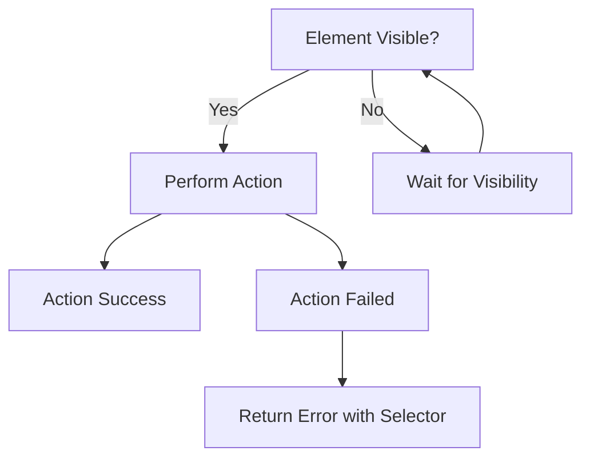
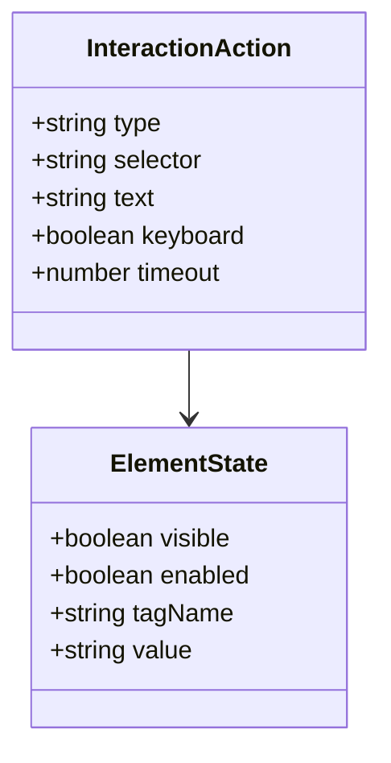

# Interaction

Interact with web page elements through clicks and text input. Enable user-like interactions with DOM elements.

## Overview

Interaction operations simulate user actions on web pages. The two primary interaction methods are clicking elements and typing text into input fields. Both operations include element visibility checks.

### Interaction Flow



## API Endpoints

### Click

Click a DOM element by CSS selector.

**Endpoint:** `POST /sessions/:id/click`

**Request Body:**

```json
{
  "selector": ".submit-button"
}
```

**Parameters:**

| Field      | Type   | Description                                  |
| ---------- | ------ | -------------------------------------------- |
| `selector` | string | CSS selector for element to click (required) |

**Response:**

```json
{
  "success": true,
  "data": {
    "url": "https://example.com/new-page"
  },
  "timestamp": "2026-04-12T12:00:00.000Z"
}
```

**Selector Examples:**

```css
/* Class selector */
.submit-button

/* ID selector */
#login-form

/* Tag selector */
button[type="submit"]

/* Attribute selector */
input[name="email"]

/* Complex selector */
div.form-group input[type="text"]

/* Descendant selector */
.nav ul li a
```

### Type

Type text into an input element with realistic typing simulation.

**Endpoint:** `POST /sessions/:id/type`

**Request Body:**

```json
{
  "selector": "input[name='username']",
  "text": "john.doe@example.com",
  "keyboard": true
}
```

**Parameters:**

| Field      | Type    | Default    | Description                                    |
| ---------- | ------- | ---------- | ---------------------------------------------- |
| `selector` | string  | (required) | CSS selector for input element                 |
| `text`     | string  | (required) | Text to type                                   |
| `keyboard` | boolean | true       | Use keyboard simulation instead of direct fill |

**Response:**

```json
{
  "success": true,
  "data": {
    "url": "https://example.com/current-page"
  },
  "timestamp": "2026-04-12T12:00:00.000Z"
}
```

**Type Parameters:**

| Field     | Type   | Default | Description                                         |
| --------- | ------ | ------- | --------------------------------------------------- |
| `delay`   | number | 50      | Delay between keystrokes in milliseconds (internal) |
| `timeout` | number | 5000    | Maximum time for type operation (internal)          |

## Interaction Data Model



**Interaction State:**

| Field      | Type    | Description                        |
| ---------- | ------- | ---------------------------------- |
| `type`     | string  | Action type: click or type         |
| `selector` | string  | CSS selector for target element    |
| `text`     | string  | Text content for type operations   |
| `keyboard` | boolean | Whether to simulate keyboard input |
| `timeout`  | number  | Operation timeout in milliseconds  |

## Usage Examples

### Basic Click

```bash
# Click a button
curl -X POST http://localhost:3000/sessions/SESSION_ID/click \
  -H "Content-Type: application/json" \
  -d '{"selector": ".submit-btn"}'
```

### Type into Input

```bash
# Type email into input field
curl -X POST http://localhost:3000/sessions/SESSION_ID/type \
  -H "Content-Type: application/json" \
  -d '{
    "selector": "input[name=\"email\"]",
    "text": "user@example.com"
  }'
```

### Multi-Step Interaction Workflow

```bash
# Step 1: Navigate to login page
curl -X POST http://localhost:3000/sessions/SESSION_ID/navigate \
  -d '{"url": "https://example.com/login"}'

# Step 2: Type username
curl -X POST http://localhost:3000/sessions/SESSION_ID/type \
  -d '{"selector": "input[name=\"username\"]", "text": "johndoe"}'

# Step 3: Type password
curl -X POST http://localhost:3000/sessions/SESSION_ID/type \
  -d '{"selector": "input[name=\"password\"]", "text": "secret123"}'

# Step 4: Click submit button
curl -X POST http://localhost:3000/sessions/SESSION_ID/click \
  -d '{"selector": "button[type=\"submit\"]"}'
```

### Complex Selector Examples

```bash
# Click link in specific div
curl -X POST http://localhost:3000/sessions/SESSION_ID/click \
  -d '{"selector": "div.article-content a.read-more"}'

# Click button with specific attribute
curl -X POST http://localhost:3000/sessions/SESSION_ID/click \
  -d '{"selector": "button[data-action=\"save\"]"}'

# Click nested element
curl -X POST http://localhost:3000/sessions/SESSION_ID/click \
  -d '{"selector": "form.login-form input[type=\"email\"]"}'
```

## Error Cases

**Element Not Visible (400):**

```json
{
  "success": false,
  "error": "Timeout: Element '.submit-btn' not visible within 1000ms",
  "selector": ".submit-btn",
  "timestamp": "2026-04-12T12:00:00.000Z"
}
```

**Element Not Found (400):**

```json
{
  "success": false,
  "error": "Timeout: Could not locate element with selector '.nonexistent'",
  "selector": ".nonexistent",
  "timestamp": "2026-04-12T12:00:00.000Z"
}
```

**Type Timeout (400):**

```json
{
  "success": false,
  "error": "Type operation timed out",
  "selector": "input[name=\"username\"]",
  "timestamp": "2026-04-12T12:00:00.000Z"
}
```

## Best Practices

### Selector Strategy

1. **Use specific selectors** that won't change frequently
2. **Prefer name and id attributes** over class names
3. **Avoid fragile selectors** based on auto-generated classes
4. **Test selectors** before using in automated workflows

### Click Operations

- Elements must be visible before clicking
- Click will wait up to 1000ms for visibility
- Click triggers navigation if element is a link or submit button

### Type Operations

- Type simulation includes realistic keystroke delays (50ms)
- Maximum type timeout is 5 seconds to prevent hangs
- Keyboard mode simulates real typing; set `keyboard: false` for direct fill
- Use appropriate selectors for input types (text, password, textarea)

### Error Recovery

1. **Verify selector** matches actual DOM structure
2. **Check element visibility** - page may need to finish loading
3. **Review element state** - may be disabled or hidden
4. **Use [[features/extraction.md]]** to inspect element attributes

## Related Documentation

- [[features/navigation.md]] - Navigate to pages before interaction
- [[features/form-handling.md]] - Form-specific interaction methods
- [[features/extraction.md]] - Inspect elements before interacting
- [[qa/basic-workflows.md]] - Interaction workflow examples

## Tags

`#interaction` `#click` `#type` `#user-action` `#dom-manipulation` `#css-selector` `#input`
