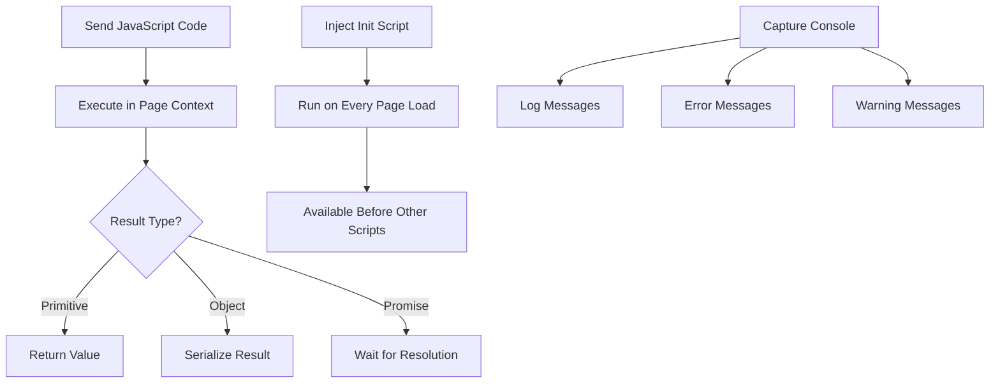
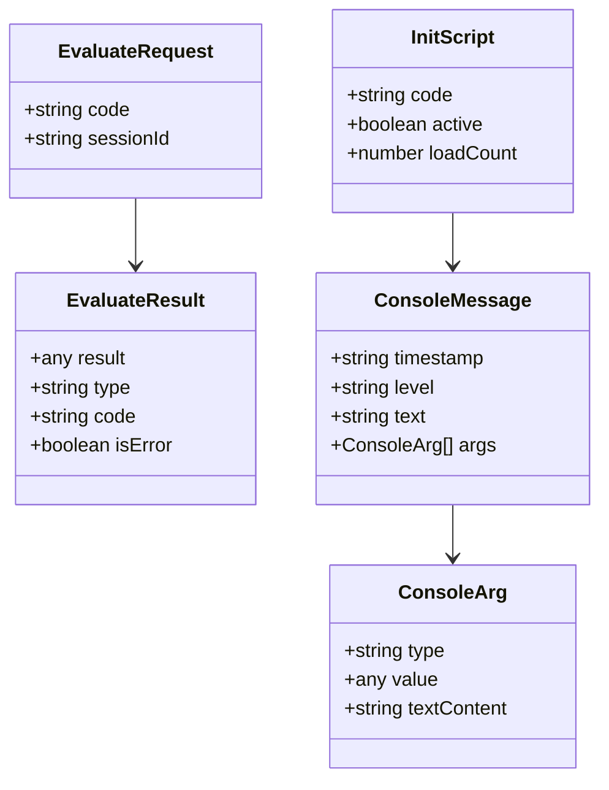

# JavaScript Execution

Execute custom JavaScript in the browser context. Run arbitrary code, inject scripts, and capture console output for dynamic content analysis.

## Overview

JavaScript execution allows running custom JavaScript code within the page context. This enables dynamic content manipulation, custom data extraction, and debugging through console message capture. All code executes with full access to the DOM and page APIs.

### Execution Flow



## API Endpoints

### Evaluate

Execute JavaScript code in the page context and return the result.

**Endpoint:** `POST /sessions/:id/evaluate`

**Request Body:**

```json
{
  "code": "() => document.querySelectorAll('.product').length"
}
```

**Parameters:**

| Field  | Type   | Description                           |
| ------ | ------ | ------------------------------------- |
| `code` | string | JavaScript code to execute (required) |

**Response:**

```json
{
  "success": true,
  "data": {
    "result": 5,
    "type": "number",
    "code": "() => document.querySelectorAll('.product').length"
  },
  "timestamp": "2026-04-12T12:00:00.000Z"
}
```

**Result Fields:**

| Field    | Type   | Description                                                          |
| -------- | ------ | -------------------------------------------------------------------- |
| `result` | any    | Evaluated result (any JavaScript type)                               |
| `type`   | string | Result type: string, number, boolean, object, array, null, undefined |
| `code`   | string | Original code that was executed                                      |

### Add Init Script

Inject JavaScript that runs on every page load before other scripts.

**Endpoint:** `POST /sessions/:id/add-init-script`

**Request Body:**

```json
{
  "code": "console.log('Custom init script loaded')"
}
```

**Parameters:**

| Field  | Type   | Description                          |
| ------ | ------ | ------------------------------------ |
| `code` | string | JavaScript code to inject (required) |

**Response:**

```json
{
  "success": true,
  "data": {},
  "timestamp": "2026-04-12T12:00:00.000Z"
}
```

**Init Script Behavior:**

- Executes on every page navigation
- Runs before other page scripts
- Persists for the session lifetime
- Can modify window object or add global functions

### Console Messages

Capture console messages from page execution.

**Endpoint:** `GET /sessions/:id/console-messages`

**Query Parameters:**

- `level` - Filter by level: log, info, warn, error (optional)

**Request Body:** None

**Response:**

```json
{
  "success": true,
  "data": {
    "messages": [
      {
        "timestamp": "2026-04-12T12:00:00.000Z",
        "level": "log",
        "text": "Page initialized",
        "args": [
          {
            "type": "string",
            "value": "Page initialized"
          }
        ]
      },
      {
        "timestamp": "2026-04-12T12:00:01.000Z",
        "level": "error",
        "text": "Failed to load resource",
        "args": [
          {
            "type": "string",
            "value": "https://cdn.example.com/missing.js"
          }
        ]
      }
    ]
  },
  "timestamp": "2026-04-12T12:00:02.000Z"
}
```

**Console Message Fields:**

| Field       | Type   | Description                                  |
| ----------- | ------ | -------------------------------------------- |
| `timestamp` | string | ISO timestamp of message                     |
| `level`     | string | Console level: log, info, warn, error, debug |
| `text`      | string | Main console message text                    |
| `args`      | array  | Additional arguments passed to console       |

**Console Arg Fields:**

| Field   | Type   | Description                                          |
| ------- | ------ | ---------------------------------------------------- |
| `type`  | string | Argument type: string, number, object, element, etc. |
| `value` | any    | Argument value (may be null for complex types)       |

## JavaScript Execution Data Model



## Usage Examples

### Basic JavaScript Evaluation

```bash
# Get page title
curl -X POST http://localhost:3000/sessions/SESSION_ID/evaluate \
  -H "Content-Type: application/json" \
  -d '{"code": "document.title"}'

# Get current URL
curl -X POST http://localhost:3000/sessions/SESSION_ID/evaluate \
  -d '{"code": "window.location.href"}'

# Check if element exists
curl -X POST http://localhost:3000/sessions/SESSION_ID/evaluate \
  -d '{"code": "document.querySelector(\\".product\\") !== null"}'
```

### Extract Data from Page

```bash
# Count products on page
curl -X POST http://localhost:3000/sessions/SESSION_ID/evaluate \
  -d '{"code": "[...document.querySelectorAll(\\".product-card\\")].length"}'

# Extract all product prices
curl -X POST http://localhost:3000/sessions/SESSION_ID/evaluate \
  -d '{"code": "[...document.querySelectorAll(\\".price\\")].map(el => el.innerText)"}'

# Get all links with text
curl -X POST http://localhost:3000/sessions/SESSION_ID/evaluate \
  -d '{"code": "[...document.querySelectorAll(\\"a\\")].map(a => ({href: a.href, text: a.innerText}))"}'
```

### Complex Data Extraction

```bash
# Extract product data as structured array
curl -X POST http://localhost:3000/sessions/SESSION_ID/evaluate \
  -H "Content-Type: application/json" \
  -d '{
    "code": "[...document.querySelectorAll(\\".product\\")].map(product => ({
      name: product.querySelector(\\".name\\").innerText,
      price: product.querySelector(\\".price\\").innerText,
      url: product.querySelector(\\"a\\").href
    }))"
  }'

# Get form field values
curl -X POST http://localhost:3000/sessions/SESSION_ID/evaluate \
  -d '{"code": "Object.fromEntries([...document.querySelectorAll(\\"form input\\")].map(input => [input.name, input.value]))"}'

# Check page state
curl -X POST http://localhost:3000/sessions/SESSION_ID/evaluate \
  -d '{"code": "() => ({\n  hasLogin: !!document.querySelector(\\"#login\\"),\n  isLoggedIn: document.querySelector(\\".user-menu\\") !== null,\n  cartCount: document.querySelector(\\".cart-count\\")?.innerText || 0\n})"}'
```

### Add Init Script for Custom Logging

```bash
# Inject custom logging function
curl -X POST http://localhost:3000/sessions/SESSION_ID/add-init-script \
  -H "Content-Type: application/json" \
  -d '{
    "code": "window.customLogger = {
      track: function(event, data) {
        console.log(\`CUSTOM: \${event}\`, data);
      }
    };
    window.customLogger.track(\\"init\\", {version: \\"1.0\\"});"
  }'

# Use custom logger in evaluation
curl -X POST http://localhost:3000/sessions/SESSION_ID/evaluate \
  -d '{"code": "window.customLogger.track(\\"page-view\\", {url: window.location.href})"}'

# Capture console messages
curl http://localhost:3000/sessions/SESSION_ID/console-messages
```

### Debug with Console Messages

```bash
# Navigate to page with potential errors
curl -X POST http://localhost:3000/sessions/SESSION_ID/navigate \
  -d '{"url": "https://example.com"}'

# Wait for page to load
curl -X POST http://localhost:3000/sessions/SESSION_ID/wait-for \
  -d '{"condition": {"type": "networkidle"}}'

# Get all error messages
curl "http://localhost:3000/sessions/SESSION_ID/console-messages?level=error"

# Get warning messages
curl "http://localhost:3000/sessions/SESSION_ID/console-messages?level=warn"

# Get all messages
curl http://localhost:3000/sessions/SESSION_ID/console-messages
```

### Advanced JavaScript Patterns

```bash
# Wait for dynamic content with evaluate
curl -X POST http://localhost:3000/sessions/SESSION_ID/evaluate \
  -d '{
    "code": "() => new Promise(resolve => {
      const check = () => {
        const elements = document.querySelectorAll(\\".dynamic-item\\");
        if (elements.length > 0) resolve(true);
        else setTimeout(check, 100);
      };
      check();
    })"
  }'

# Modify page content
curl -X POST http://localhost:3000/sessions/SESSION_ID/evaluate \
  -d '{"code": "document.body.style.backgroundColor = \\"lightblue\\""}'

# Add event listeners
curl -X POST http://localhost:3000/sessions/SESSION_ID/evaluate \
  -d '{
    "code": "document.querySelector(\\".submit-btn\\").addEventListener(\\"click\\", () => console.log(\\"Custom click handler\\"));"
  }'

# Interact with APIs on page
curl -X POST http://localhost:3000/sessions/SESSION_ID/evaluate \
  -d '{"code": "fetch(\\"/api/data\\").then(r => r.json())"}'
```

### Complete Debugging Workflow

```bash
# Step 1: Add init script for custom logging
curl -X POST http://localhost:3000/sessions/SESSION_ID/add-init-script \
  -d '{"code": "console.log(\\"=== DEBUG START ===\"); window.DEBUG = true;"}'

# Step 2: Navigate to page
curl -X POST http://localhost:3000/sessions/SESSION_ID/navigate \
  -d '{"url": "https://example.com"}'

# Step 3: Wait for load
curl -X POST http://localhost:3000/sessions/SESSION_ID/wait-for \
  -d '{"condition": {"type": "networkidle"}}'

# Step 4: Run custom analysis
curl -X POST http://localhost:3000/sessions/SESSION_ID/evaluate \
  -d '{"code": "console.log(\\"Page analysis\\", document.title); document.querySelectorAll(\\".error-msg\\").forEach(el => console.error(\\"Error found\\", el.innerText));"}'

# Step 5: Capture all console output
curl http://localhost:3000/sessions/SESSION_ID/console-messages

# Step 6: Extract specific data
curl -X POST http://localhost:3000/sessions/SESSION_ID/evaluate \
  -d '{"code": "[...document.querySelectorAll(\\".error-msg\\")].map(el => el.innerText)"}'
```

## Error Cases

**JavaScript Syntax Error (500):**

```json
{
  "success": false,
  "error": "SyntaxError: Unexpected token ')' ",
  "code": "() => document.querySelectorAll('.products'",
  "stack": "SyntaxError: ...\n    at evaluate...",
  "timestamp": "2026-04-12T12:00:00.000Z"
}
```

**JavaScript Runtime Error (500):**

```json
{
  "success": false,
  "error": "TypeError: Cannot read property 'length' of undefined",
  "code": "document.querySelector('.items').length",
  "stack": "TypeError: ...\n    at evaluate...",
  "timestamp": "2026-04-12T12:00:00.000Z"
}
```

**Init Script Error (500):**

```json
{
  "success": false,
  "error": "ReferenceError: customFn is not defined",
  "timestamp": "2026-04-12T12:00:00.000Z"
}
```

## Best Practices

### Code Safety

1. **Validate code syntax** before sending
2. **Handle errors gracefully** in evaluated code
3. **Avoid infinite loops** that can freeze browser
4. **Keep code focused** on single task
5. **Return structured data** for easy parsing

### Performance

1. **Use efficient selectors** - query once, reuse results
2. **Avoid repeated DOM queries** in loops
3. **Use Array methods** for clean data transformation
4. **Return early** when condition is met
5. **Use Promises** for async operations

### Debugging

1. **Add init scripts** for persistent logging
2. **Capture console messages** to debug page behavior
3. **Filter by level** to focus on errors/warnings
4. **Log intermediate values** during complex operations
5. **Use browser DevTools** patterns in code

### Data Extraction

1. **Return arrays/objects** for structured data
2. **Map over collections** for consistent format
3. **Handle null/undefined** gracefully
4. **Normalize data** before returning
5. **Include metadata** like counts or timestamps

## Related Documentation

- [[features/extraction.md]] - Content extraction with evaluate
- [[features/advanced-features.md]] - Wait conditions using function type
- [[qa/research-task.md]] - JavaScript in research workflows
- [[technical/api-reference.md]] - API endpoint reference

## Tags

`#javascript-execution` `#evaluate` `#init-script` `#console-messages` `#dom-manipulation` `#data-extraction` `#debugging` `#browser-context` `#dynamic-content`
