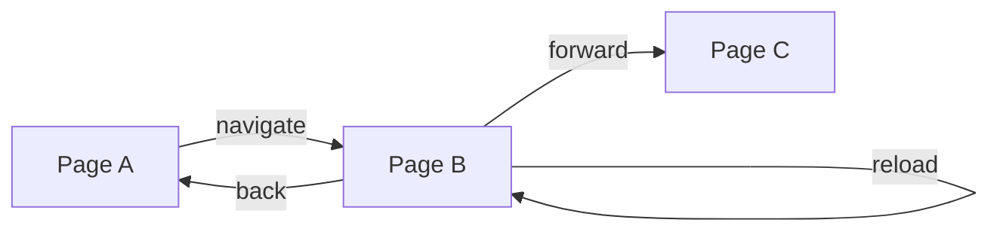

# Navigation

Navigate through web pages within a browser session. Control page transitions, history, and loading states.

## Overview

Navigation operations allow you to move between URLs, traverse browser history, and reload pages. All navigation occurs within the current session's browser context.

### Navigation Flow



## API Endpoints

### Navigate

Navigate to a URL with configurable wait conditions.

**Endpoint:** `POST /sessions/:id/navigate`

**Request Body:**

```json
{
  "url": "https://example.com",
  "waitUntil": "networkidle",
  "timeout": 30000
}
```

**Parameters:**

| Field       | Type   | Default       | Description                                                         |
| ----------- | ------ | ------------- | ------------------------------------------------------------------- |
| `url`       | string | (required)    | Target URL to navigate to                                           |
| `waitUntil` | string | "networkidle" | Load event to wait for: load, domcontentloaded, networkidle, commit |
| `timeout`   | number | 30000         | Maximum time in milliseconds before timeout                         |

**Response:**

```json
{
  "success": true,
  "data": {
    "url": "https://example.com"
  },
  "timestamp": "2026-04-12T12:00:00.000Z"
}
```

**Wait Until Options:**

| Value              | Description                                                                |
| ------------------ | -------------------------------------------------------------------------- |
| `load`             | Wait until the load event fires                                            |
| `domcontentloaded` | Wait until DOMContentLoaded event fires                                    |
| `networkidle`      | Wait until there are no more than 2 network connections for at least 500ms |
| `commit`           | Wait until navigation commits                                              |

### Back

Navigate to the previous page in browser history.

**Endpoint:** `POST /sessions/:id/back`

**Request Body:** None

**Response:**

```json
{
  "success": true,
  "data": {
    "url": "https://previous-page.com"
  },
  "timestamp": "2026-04-12T12:00:00.000Z"
}
```

### Forward

Navigate to the next page in browser history.

**Endpoint:** `POST /sessions/:id/forward`

**Request Body:** None

**Response:**

```json
{
  "success": true,
  "data": {
    "url": "https://next-page.com"
  },
  "timestamp": "2026-04-12T12:00:00.000Z"
}
```

### Reload

Refresh the current page.

**Endpoint:** `POST /sessions/:id/reload`

**Request Body:** None

**Response:**

```json
{
  "success": true,
  "data": {
    "url": "https://current-page.com"
  },
  "timestamp": "2026-04-12T12:00:00.000Z"
}
```

## Navigation Data Model

```mermaid
classDiagram
    class NavigationState {
        +string currentUrl
        +string[] history
        +number historyIndex
        +loadState currentLoadState
    }

    enum LoadState {
        loading
        domcontentloaded
        networkidle
        load
    }

    NavigationState --> LoadState
```

**Navigation State:**

| Field              | Type      | Description                 |
| ------------------ | --------- | --------------------------- |
| `currentUrl`       | string    | Current page URL            |
| `history`          | string[]  | Browser history stack       |
| `historyIndex`     | number    | Current position in history |
| `currentLoadState` | LoadState | Current page load state     |

## Usage Examples

### Basic Navigation

```bash
# Navigate to a page
curl -X POST http://localhost:3000/sessions/SESSION_ID/navigate \
  -H "Content-Type: application/json" \
  -d '{"url": "https://example.com", "waitUntil": "networkidle"}'

# Go back in history
curl -X POST http://localhost:3000/sessions/SESSION_ID/back \
  -H "Content-Type: application/json"

# Reload current page
curl -X POST http://localhost:3000/sessions/SESSION_ID/reload \
  -H "Content-Type: application/json"
```

### Navigate with Custom Timeout

```json
{
  "url": "https://slow-page.com",
  "waitUntil": "load",
  "timeout": 60000
}
```

### Multi-Step Navigation Workflow

```bash
# Step 1: Navigate to homepage
curl -X POST http://localhost:3000/sessions/SESSION_ID/navigate \
  -d '{"url": "https://example.com"}'

# Step 2: Click a link (returns new URL)
curl -X POST http://localhost:3000/sessions/SESSION_ID/click \
  -d '{"selector": ".article-link"}'

# Step 3: Go back to homepage
curl -X POST http://localhost:3000/sessions/SESSION_ID/back

# Step 4: Navigate directly to another page
curl -X POST http://localhost:3000/sessions/SESSION_ID/navigate \
  -d '{"url": "https://example.com/about"}'
```

### Fast Navigation (DOM Only)

For quick navigation when full page load is not needed:

```json
{
  "url": "https://example.com",
  "waitUntil": "domcontentloaded"
}
```

## Error Cases

**Navigation Timeout (400):**

```json
{
  "success": false,
  "error": "Navigation timeout exceeded",
  "url": "https://current-page.com",
  "timestamp": "2026-04-12T12:00:00.000Z"
}
```

**Invalid URL (400):**

```json
{
  "success": false,
  "error": "Failed to navigate: Invalid URL",
  "timestamp": "2026-04-12T12:00:00.000Z"
}
```

**No History to Go Back (400):**

```json
{
  "success": false,
  "error": "Cannot go back - no previous page",
  "timestamp": "2026-04-12T12:00:00.000Z"
}
```

## Best Practices

### Wait Strategy Selection

| Scenario              | Recommended waitUntil |
| --------------------- | --------------------- |
| Standard pages        | networkidle           |
| SPA with lazy loading | networkidle           |
| Quick navigation      | domcontentloaded      |
| Full page render      | load                  |
| Commit-only check     | commit                |

### Error Recovery

1. **Timeout errors**: Increase timeout value for slow pages
2. **Navigation failures**: Check URL format and accessibility
3. **History operations**: Verify browser history exists before back/forward

### Performance Tips

- Use `domcontentloaded` for faster navigation when full load is not needed
- Use `networkidle` for reliable page readiness detection
- Set appropriate timeouts based on expected page load times

## Related Documentation

- [[features/session-management.md]] - Session lifecycle and management
- [[features/interaction.md]] - Click navigation after page loads
- [[features/advanced-features.md]] - Wait conditions and timeouts
- [[qa/basic-workflows.md]] - Navigation workflow examples

## Tags

`#navigation` `#page-transition` `#browser-history` `#url` `#load-state` `#timeout`
