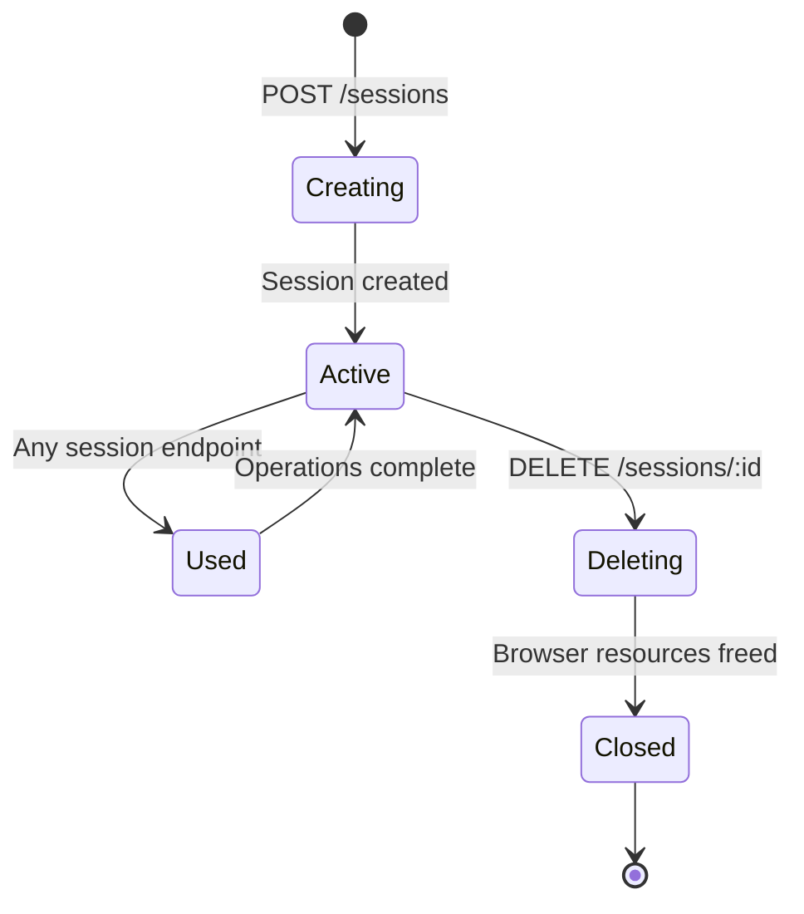
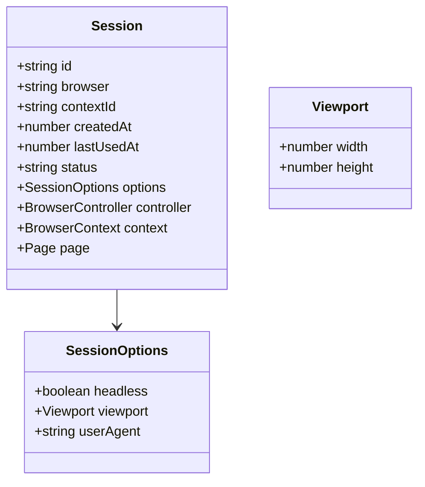

# Session Management

Manage browser sessions for isolated web automation tasks. Sessions provide persistent browser contexts that enable multi-step workflows.

## Overview

Sessions are the foundation of all API operations. Each session creates an isolated browser environment with its own context, page, and state.

### Session Lifecycle



## API Endpoints

### Create Session

Create a new browser session with custom configuration.

**Endpoint:** `POST /sessions`

**Request Body:**

```json
{
  "browser": "chromium",
  "headless": true,
  "viewport": {
    "width": 1280,
    "height": 720
  }
}
```

**Parameters:**

| Field      | Type    | Default                    | Description                                |
| ---------- | ------- | -------------------------- | ------------------------------------------ |
| `browser`  | string  | "chromium"                 | Browser type: chromium, firefox, or webkit |
| `headless` | boolean | true                       | Run browser without UI                     |
| `viewport` | object  | {width: 1280, height: 720} | Initial viewport dimensions                |

**Response:**

```json
{
  "success": true,
  "data": {
    "id": "550e8400-e29b-41d4-a716-446655440000",
    "browser": "chromium",
    "contextId": null,
    "createdAt": 1712937600000,
    "lastUsedAt": 1712937600000,
    "status": "active",
    "options": {
      "headless": true,
      "viewport": {
        "width": 1280,
        "height": 720
      },
      "userAgent": null
    }
  },
  "timestamp": "2026-04-12T12:00:00.000Z"
}
```

**Use the returned `id` in all subsequent requests.**

### Get Session

Retrieve session information and status.

**Endpoint:** `GET /sessions/:id`

**Path Parameters:**

- `id` - Session UUID (required)

**Response:**

```json
{
  "success": true,
  "data": {
    "id": "550e8400-e29b-41d4-a716-446655440000",
    "browser": "chromium",
    "contextId": null,
    "createdAt": 1712937600000,
    "lastUsedAt": 1712937600000,
    "status": "active",
    "options": {
      "headless": true,
      "viewport": {
        "width": 1280,
        "height": 720
      }
    }
  },
  "timestamp": "2026-04-12T12:00:00.000Z"
}
```

### Delete Session

Close browser session and free resources. Always delete sessions after use.

**Endpoint:** `DELETE /sessions/:id`

**Path Parameters:**

- `id` - Session UUID (required)

**Response:** `204 No Content` (success) or error response

## Session Data Model



**Fields:**

| Field        | Type   | Description                                   |
| ------------ | ------ | --------------------------------------------- |
| `id`         | string | Unique session identifier (UUID)              |
| `browser`    | string | Browser type used (chromium, firefox, webkit) |
| `contextId`  | string | Browser context identifier                    |
| `createdAt`  | number | Unix timestamp in milliseconds                |
| `lastUsedAt` | number | Unix timestamp of last operation              |
| `status`     | string | Session status: active, idle, closed          |
| `options`    | object | Configuration options                         |

## Usage Examples

### Basic Session Workflow

```bash
# Step 1: Create session
curl -X POST http://localhost:3000/sessions \
  -H "Content-Type: application/json" \
  -d '{"browser": "chromium", "headless": true}'

# Response includes: {"id": "..."}

# Step 2: Use session (replace SESSION_ID)
curl -X POST http://localhost:3000/sessions/SESSION_ID/navigate \
  -H "Content-Type: application/json" \
  -d '{"url": "https://example.com"}'

# Step 3: Delete session when done
curl -X DELETE http://localhost:3000/sessions/SESSION_ID
```

### Create Session with Custom Viewport

```json
{
  "browser": "firefox",
  "headless": false,
  "viewport": {
    "width": 1920,
    "height": 1080
  }
}
```

### Error Cases

**Session Not Found (404):**

```json
{
  "success": false,
  "error": "Session not found",
  "timestamp": "2026-04-12T12:00:00.000Z"
}
```

**Invalid Browser Type (400):**

```json
{
  "success": false,
  "error": "Unsupported browser type: opera",
  "timestamp": "2026-04-12T12:00:00.000Z"
}
```

## Best Practices

### Resource Management

1. **Always delete sessions** after completing tasks to free browser resources
2. **Reuse sessions** for multi-step workflows instead of creating new ones
3. **Monitor session count** to prevent resource exhaustion

### Session Isolation

Each session provides complete isolation:

- Separate browser context
- Independent cookies and storage
- Isolated JavaScript execution environment
- No state leakage between sessions

### Error Recovery

If session operations fail:

1. Check session status with `GET /sessions/:id`
2. Verify session exists and is active
3. Delete and recreate if session is corrupted
4. Check rate limits (100 requests per 60 seconds)

## Related Documentation

- [[features/navigation.md]] - Navigation operations within sessions
- [[features/interaction.md]] - User interaction operations
- [[technical/configuration.md]] - Environment configuration
- [[architecture/overview.md]] - Session architecture in system design

## Tags

`#session-management` `#lifecycle` `#browser-context` `#isolation` `#resource-management`
