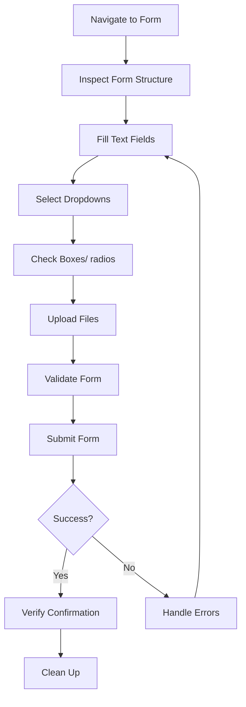

# Form Submission

Complete guide to automating form filling and submission with practical examples.

## Form Automation Overview

This guide covers complete form automation workflows including:

- Multi-field form filling
- File uploads
- Dropdown selection
- Checkbox handling
- Form validation
- Submission and confirmation

### Form Workflow



## Example: Contact Form Submission

Fill and submit a standard contact form.

### Step 1: Navigate to Form

```bash
# Create session
SESSION_ID=$(curl -s -X POST http://localhost:3000/sessions \
  -d '{"browser": "chromium"}' | jq -r '.data.id')

# Navigate to contact page
curl -X POST http://localhost:3000/sessions/$SESSION_ID/navigate \
  -d '{"url": "https://example.com/contact"}'

# Wait for form to load
curl -X POST http://localhost:3000/sessions/$SESSION_ID/wait-for \
  -d '{"condition": {"type": "selector", "selector": "form.contact-form"}}'
```

### Step 2: Inspect Form Structure

```bash
# Get form structure
curl -s -X POST http://localhost:3000/sessions/$SESSION_ID/evaluate \
  -H "Content-Type: application/json" \
  -d '{
    "code": "(() => {\n  const form = document.querySelector(\\".contact-form\\");\n  if (!form) return { error: \\"Form not found\\" };\n  \n  const fields = [...form.querySelectorAll(\\"input, textarea, select\\")].map(el => ({\n    name: el.name,\n    type: el.type || el.tagName.toLowerCase(),\n    id: el.id,\n    required: el.hasAttribute(\\"required\\")\n  }));\n  \n  return { fields, action: form.action, method: form.method };\n })()"
  }' | jq '.data.result'
```

### Step 3: Fill Text Fields

```bash
# Fill contact form fields
curl -X POST http://localhost:3000/sessions/$SESSION_ID/fill-form \
  -H "Content-Type: application/json" \
  -d '{
    "fields": {
      "name": "John Doe",
      "email": "john.doe@example.com",
      "phone": "+1-555-123-4567",
      "subject": "General Inquiry",
      "message": "Hello, I have a question about your services. Please contact me at your earliest convenience."
    }
  }'
```

### Step 4: Select Dropdown Option

```bash
# Select department from dropdown
curl -X POST http://localhost:3000/sessions/$SESSION_ID/select-option \
  -H "Content-Type: application/json" \
  -d '{
    "selector": "select[name=\"department\"]",
    "value": "support"
  }'
```

### Step 5: Check Required Boxes

```bash
# Check terms and conditions
curl -X POST http://localhost:3000/sessions/$SESSION_ID/check \
  -H "Content-Type: application/json" \
  -d '{
    "selector": "input[name=\"terms\"]",
    "checked": true
  }'

# Optionally check newsletter subscription
curl -X POST http://localhost:3000/sessions/$SESSION_ID/check \
  -d '{
    "selector": "input[name=\"newsletter\"]",
    "checked": true
  }'
```

### Step 6: Submit Form

```bash
# Submit form and wait for response page
curl -X POST http://localhost:3000/sessions/$SESSION_ID/submit-form \
  -H "Content-Type: application/json" \
  -d '{
    "selector": "button[type=\"submit\"]",
    "url": "https://example.com/thank-you",
    "timeout": 15000
  }'
```

### Step 7: Verify Submission Success

```bash
# Check for success message
SUCCESS_CHECK=$(curl -s -X POST http://localhost:3000/sessions/$SESSION_ID/evaluate \
  -d '{
    "code": "document.querySelector(\\".success-message\\") !== null || \n          document.querySelector(\\"#thank-you\\") !== null ||\n          window.location.pathname.includes(\\"thank-you\\")"
  }' | jq '.data.result')

echo "Form submission successful: $SUCCESS_CHECK"

# Get confirmation message text
if [ "$SUCCESS_CHECK" = "true" ]; then
  CONFIRMATION=$(curl -s -X POST http://localhost:3000/sessions/$SESSION_ID/evaluate \
    -d '{"code": "document.querySelector(\\".success-message\\")?.innerText || document.querySelector(\\"#thank-you\\")?.innerText"}' | jq '.data.result')

  echo "Confirmation: $CONFIRMATION"
fi
```

### Step 8: Clean Up

```bash
curl -X DELETE http://localhost:3000/sessions/$SESSION_ID
```

## Example: Registration Form with File Upload

Complete registration form with profile picture upload.

### Step 1: Navigate to Registration Page

```bash
SESSION_ID=$(curl -s -X POST http://localhost:3000/sessions \
  -d '{"browser": "chromium"}' | jq -r '.data.id')

curl -X POST http://localhost:3000/sessions/$SESSION_ID/navigate \
  -d '{"url": "https://example.com/register"}'

curl -X POST http://localhost:3000/sessions/$SESSION_ID/wait-for \
  -d '{"condition": {"type": "networkidle"}}'
```

### Step 2: Fill Registration Fields

```bash
# Fill registration form with all fields including file upload
curl -X POST http://localhost:3000/sessions/$SESSION_ID/fill-form \
  -H "Content-Type: application/json" \
  -d '{
    "fields": {
      "username": "johndoe2024",
      "email": "john.doe@example.com",
      "password": "SecurePass123!",
      "confirm_password": "SecurePass123!",
      "first_name": "John",
      "last_name": "Doe",
      "date_of_birth": "1990-01-15",
      "country": "United States",
      "phone": "5551234567",
      "bio": "Software developer interested in web technologies.",
      "profile_picture.file": "/path/to/profile.jpg"
    }
  }'
```

### Step 3: Select Preferences

```bash
# Select preferred communication method
curl -X POST http://localhost:3000/sessions/$SESSION_ID/select-option \
  -d '{
    "selector": "select[name=\"contact_method\"]",
    "value": "email"
  }'

# Select time zone
curl -X POST http://localhost:3000/sessions/$SESSION_ID/select-option \
  -d '{
    "selector": "select[name=\"timezone\"]",
    "value": "America/New_York"
  }'
```

### Step 4: Set Preferences (Checkboxes)

```bash
# Check terms of service
curl -X POST http://localhost:3000/sessions/$SESSION_ID/check \
  -d '{
    "selector": "input[name=\"terms_of_service\"]",
    "checked": true
  }'

# Check privacy policy acknowledgment
curl -X POST http://localhost:3000/sessions/$SESSION_ID/check \
  -d '{
    "selector": "input[name=\"privacy_policy\"]",
    "checked": true
  }'

# Opt-in to marketing emails
curl -X POST http://localhost:3000/sessions/$SESSION_ID/check \
  -d '{
    "selector": "input[name=\"marketing_emails\"]",
    "checked": false
  }'
```

### Step 5: Validate Form Before Submission

```bash
# Check if all required fields are filled
VALIDATION=$(curl -s -X POST http://localhost:3000/sessions/$SESSION_ID/evaluate \
  -d '{
    "code": "(() => {\n  const form = document.querySelector(\\"form.register\\");\n  const required = [...form.querySelectorAll(\\"[required]\\")];\n  const filled = required.every(el => {\n    if (el.type === \\"checkbox\\") return el.checked;\n    return el.value.trim() !== \\"\\";\n  });\n  \n  return {\n    valid: filled,\n    requiredCount: required.length,\n    filledCount: required.filter(el => {\n      if (el.type === \\"checkbox\\") return el.checked;\n      return el.value.trim() !== \\"\\";\n    }).length\n  };\n })()"
  }' | jq '.data.result')

echo "Form validation: $VALIDATION"
```

### Step 6: Submit Registration

```bash
# Submit registration form
curl -X POST http://localhost:3000/sessions/$SESSION_ID/submit-form \
  -H "Content-Type: application/json" \
  -d '{
    "selector": "button[type=\"submit\"]",
    "url": "https://example.com/register/success",
    "timeout": 20000
  }'
```

### Step 7: Verify Account Creation

```bash
# Check for account created message
ACCOUNT_CREATED=$(curl -s -X POST http://localhost:3000/sessions/$SESSION_ID/evaluate \
  -d '{"code": "document.querySelector(\\".account-created\\") !== null || document.querySelector(\\"#welcome\\") !== null"}' | jq '.data.result')

echo "Account created successfully: $ACCOUNT_CREATED"

# Get user info if available
if [ "$ACCOUNT_CREATED" = "true" ]; then
  USER_INFO=$(curl -s -X POST http://localhost:3000/sessions/$SESSION_ID/evaluate \
    -d '{"code": "document.querySelector(\\".user-info\\")?.innerText"}' | jq '.data.result')

  echo "User info: $USER_INFO"
fi
```

### Step 8: Clean Up

```bash
curl -X DELETE http://localhost:3000/sessions/$SESSION_ID
```

## Example: Multi-Step Form

Handle a form that requires multiple steps or sections.

```bash
SESSION_ID=$(curl -s -X POST http://localhost:3000/sessions \
  -d '{"browser": "chromium"}' | jq -r '.data.id')

# Navigate to multi-step form
curl -X POST http://localhost:3000/sessions/$SESSION_ID/navigate \
  -d '{"url": "https://example.com/application"}'

# Step 1: Personal Information
curl -X POST http://localhost:3000/sessions/$SESSION_ID/fill-form \
  -d '{
    "fields": {
      "first_name": "Jane",
      "last_name": "Smith",
      "email": "jane.smith@example.com",
      "phone": "555-987-6543"
    }
  }'

# Click "Next" button
curl -X POST http://localhost:3000/sessions/$SESSION_ID/click \
  -d '{"selector": "button[data-step=\"2\"]"}'

# Wait for step 2 to load
curl -X POST http://localhost:3000/sessions/$SESSION_ID/wait-for \
  -d '{"condition": {"type": "selector", "selector": ".step-2"}}'

# Step 2: Education
curl -X POST http://localhost:3000/sessions/$SESSION_ID/fill-form \
  -d '{
    "fields": {
      "degree": "Bachelor",
      "major": "Computer Science",
      "university": "State University"
    }
  }'

# Select graduation year from dropdown
curl -X POST http://localhost:3000/sessions/$SESSION_ID/select-option \
  -d '{
    "selector": "select[name=\"graduation_year\"]",
    "value": "2024"
  }'

# Click "Next" to step 3
curl -X POST http://localhost:3000/sessions/$SESSION_ID/click \
  -d '{"selector": "button[data-step=\"3\"]"}'

# Wait for step 3
curl -X POST http://localhost:3000/sessions/$SESSION_ID/wait-for \
  -d '{"condition": {"type": "selector", "selector": ".step-3"}}'

# Step 3: Experience
curl -X POST http://localhost:3000/sessions/$SESSION_ID/fill-form \
  -d '{
    "fields": {
      "years_experience": "5",
      "current_role": "Software Developer"
    }
  }'

# Upload resume
curl -X POST http://localhost:3000/sessions/$SESSION_ID/fill-form \
  -d '{
    "fields": {
      "resume.file": "/path/to/resume.pdf"
    }
  }'

# Submit final form
curl -X POST http://localhost:3000/sessions/$SESSION_ID/submit-form \
  -d '{
    "selector": "button[type=\"submit\"]",
    "url": "https://example.com/application/success"
  }'

curl -X DELETE http://localhost:3000/sessions/$SESSION_ID
```

## Example: Search and Filter Form

Handle forms with search and filter functionality.

```bash
SESSION_ID=$(curl -s -X POST http://localhost:3000/sessions \
  -d '{"browser": "chromium"}' | jq -r '.data.id')

# Navigate to search page
curl -X POST http://localhost:3000/sessions/$SESSION_ID/navigate \
  -d '{"url": "https://example.com/products"}'

# Fill search criteria
curl -X POST http://localhost:3000/sessions/$SESSION_ID/fill-form \
  -H "Content-Type: application/json" \
  -d '{
    "fields": {
      "search_query": "laptop",
      "min_price": "500",
      "max_price": "2000"
    }
  }'

# Select category
curl -X POST http://localhost:3000/sessions/$SESSION_ID/select-option \
  -H "Content-Type: application/json" \
  -d '{
    "selector": "select[name=\"category\"]",
    "value": "electronics"
  }'

# Set filters (checkboxes)
curl -X POST http://localhost:3000/sessions/$SESSION_ID/check \
  -d '{
    "selector": "input[name=\"in_stock\"]",
    "checked": true
  }'

curl -X POST http://localhost:3000/sessions/$SESSION_ID/check \
  -d '{
    "selector": "input[name=\"on_sale\"]",
    "checked": false
  }'

# Select sort option
curl -X POST http://localhost:3000/sessions/$SESSION_ID/select-option \
  -d '{
    "selector": "select[name=\"sort_by\"]",
    "value": "price_low"
  }'

# Submit search
curl -X POST http://localhost:3000/sessions/$SESSION_ID/submit-form \
  -d '{"selector": "button[type=\"submit\"]"}'

# Wait for results
curl -X POST http://localhost:3000/sessions/$SESSION_ID/wait-for \
  -d '{"condition": {"type": "selector", "selector": ".product-results"}}'

# Count results
RESULT_COUNT=$(curl -s -X POST http://localhost:3000/sessions/$SESSION_ID/evaluate \
  -d '{"code": "document.querySelectorAll(\\".product-result\\").length"}' | jq '.data.result')

echo "Found $RESULT_COUNT results"

# Extract top results
TOP_RESULTS=$(curl -s -X POST http://localhost:3000/sessions/$SESSION_ID/evaluate \
  -d '{
    "code": "[...document.querySelectorAll(\\".product-result\\")].slice(0, 5).map(p => ({\n      name: p.querySelector(\\".product-name\\")?.innerText,\n      price: p.querySelector(\\".price\\")?.innerText\n    }))"
  }' | jq '.data.result')

echo "Top results:"
echo $TOP_RESULTS | jq '.'

curl -X DELETE http://localhost:3000/sessions/$SESSION_ID
```

## Error Handling for Forms

### Handle Validation Errors

```bash
# Submit form and check for validation errors
SUBMIT_RESULT=$(curl -s -X POST http://localhost:3000/sessions/$SESSION_ID/submit-form \
  -d '{"selector": "button[type=\"submit\"]"}')

# Check if submission failed with validation errors
IS_VALIDATION_ERROR=$(echo $SUBMIT_RESULT | jq '.data.error | contains("validation" or "required")')

if [ "$IS_VALIDATION_ERROR" = "true" ]; then
  # Extract error messages
  ERROR_MESSAGES=$(curl -s -X POST http://localhost:3000/sessions/$SESSION_ID/evaluate \
    -d '{"code": "[...document.querySelectorAll(\\".error-message\\")].map(el => el.innerText)"}' | jq '.data.result')

  echo "Validation errors:"
  echo $ERROR_MESSAGES | jq '.'

  # Fix errors and retry
  # ... (fill missing fields, correct values)

  # Retry submission
  curl -X POST http://localhost:3000/sessions/$SESSION_ID/submit-form \
    -d '{"selector": "button[type=\"submit\"]"}'
fi
```

### Handle Timeout Errors

```bash
# Submit with longer timeout for slow forms
curl -X POST http://localhost:3000/sessions/$SESSION_ID/submit-form \
  -H "Content-Type: application/json" \
  -d '{
    "selector": "button[type=\"submit\"]",
    "timeout": 30000
  }'
```

## Best Practices for Form Automation

### Field Identification

1. **Use name attributes** for reliable field identification
2. **Verify field types** before filling (text, email, password, file)
3. **Handle file uploads** with `.file` suffix
4. **Test selectors** before automation

### Validation

1. **Check required fields** before submission
2. **Validate email format** for email fields
3. **Verify password strength** if applicable
4. **Check checkbox states** before submit

### Error Recovery

1. **Parse error messages** to identify issues
2. **Correct field values** based on errors
3. **Retry submission** after fixes
4. **Log errors** for debugging

### File Uploads

1. **Ensure file exists** at specified path
2. **Use correct field name** with `.file` suffix
3. **Check file size limits** on target server
4. **Verify upload completes** before submit

## Related Documentation

- [[features/form-handling.md]] - Form API reference
- [[qa/basic-workflows.md]] - Basic workflow patterns
- [[features/interaction.md]] - Click operations for multi-step forms

## Tags

`#qa` `#form-submission` `#examples` `#automation` `#file-upload` `#validation` `#multi-step` `#best-practices`
