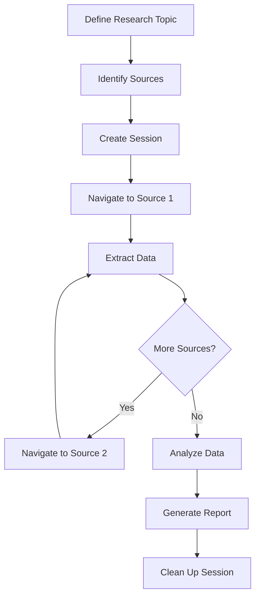

# Web Research Task

Complete example of using the API for automated web research tasks.

## Research Workflow Overview

This guide demonstrates a complete web research workflow:

1. Navigate to source pages
2. Extract structured data
3. Analyze content
4. Compare findings
5. Generate report

### Research Flow



## Example: Product Research

Research products across multiple e-commerce pages.

### Step 1: Setup Session

```bash
# Create research session
SESSION_ID=$(curl -s -X POST http://localhost:3000/sessions \
  -H "Content-Type: application/json" \
  -d '{
    "browser": "chromium",
    "headless": true,
    "viewport": {"width": 1920, "height": 1080}
  }' | jq -r '.data.id')

echo "Research session created: $SESSION_ID"
```

### Step 2: Define Research Parameters

```bash
# Products to research
PRODUCTS='["laptop", "smartphone", "tablet"]'

# Search URLs
SEARCH_URLS='[
  "https://example-shop.com/search?q=laptop",
  "https://example-shop.com/search?q=smartphone",
  "https://example-shop.com/search?q=tablet"
]'

# Extraction criteria
EXTRACTION_CONFIG='{
  "selectors": {
    "productCard": ".product-item",
    "name": ".product-name",
    "price": ".product-price",
    "rating": ".product-rating",
    "url": ".product-link"
  },
  "minProducts": 3
}'
```

### Step 3: Extract Data from First Product Category

```bash
# Navigate to laptop search results
curl -X POST http://localhost:3000/sessions/$SESSION_ID/navigate \
  -H "Content-Type: application/json" \
  -d '{"url": "https://example-shop.com/search?q=laptop"}'

# Wait for results to load
curl -X POST http://localhost:3000/sessions/$SESSION_ID/wait-for \
  -H "Content-Type: application/json" \
  -d '{
    "condition": {
      "type": "selector",
      "selector": ".product-item",
      "state": "visible"
    },
    "timeout": 30000
  }'

# Extract laptop products
LAPTOPS=$(curl -s -X POST http://localhost:3000/sessions/$SESSION_ID/evaluate \
  -H "Content-Type: application/json" \
  -d '{
    "code": "[...document.querySelectorAll(\\".product-item\\")].slice(0, 10).map(card => ({
      name: card.querySelector(\\".product-name\\")?.innerText?.trim() || \\"Unknown\\",\n      price: card.querySelector(\\".product-price\\")?.innerText?.trim() || \\"N/A\\",\n      rating: card.querySelector(\\".product-rating\\")?.innerText?.trim() || \\"No rating\\",\n      url: card.querySelector(\\".product-link\\")?.href || \\"\\"\n    }))"
  }' | jq '.data.result')

# Count extracted products
LAPTOP_COUNT=$(echo $LAPTOPS | jq 'length')
echo "Extracted $LAPTOP_COUNT laptop products"

# Save to file
echo $LAPTOPS > laptops.json
```

### Step 4: Extract Data from Second Category

```bash
# Navigate to smartphone results
curl -X POST http://localhost:3000/sessions/$SESSION_ID/navigate \
  -d '{"url": "https://example-shop.com/search?q=smartphone"}'

# Wait for results
curl -X POST http://localhost:3000/sessions/$SESSION_ID/wait-for \
  -d '{"condition": {"type": "selector", "selector": ".product-item"}}'

# Extract smartphone products
SMARTPHONES=$(curl -s -X POST http://localhost:3000/sessions/$SESSION_ID/evaluate \
  -d '{
    "code": "[...document.querySelectorAll(\\".product-item\\")].slice(0, 10).map(card => ({\n      name: card.querySelector(\\".product-name\\")?.innerText?.trim() || \\"Unknown\\",\n      price: card.querySelector(\\".product-price\\")?.innerText?.trim() || \\"N/A\\",\n      rating: card.querySelector(\\".product-rating\\")?.innerText?.trim() || \\"No rating\\",\n      url: card.querySelector(\\".product-link\\")?.href || \\"\\"\n    }))"
  }' | jq '.data.result')

SMARTPHONE_COUNT=$(echo $SMARTPHONES | jq 'length')
echo "Extracted $SMARTPHONE_COUNT smartphone products"

echo $SMARTPHONES > smartphones.json
```

### Step 5: Extract Data from Third Category

```bash
# Navigate to tablet results
curl -X POST http://localhost:3000/sessions/$SESSION_ID/navigate \
  -d '{"url": "https://example-shop.com/search?q=tablet"}'

# Wait for results
curl -X POST http://localhost:3000/sessions/$SESSION_ID/wait-for \
  -d '{"condition": {"type": "selector", "selector": ".product-item"}}'

# Extract tablet products
TABLETS=$(curl -s -X POST http://localhost:3000/sessions/$SESSION_ID/evaluate \
  -d '{
    "code": "[...document.querySelectorAll(\\".product-item\\")].slice(0, 10).map(card => ({\n      name: card.querySelector(\\".product-name\\")?.innerText?.trim() || \\"Unknown\\",\n      price: card.querySelector(\\".product-price\\")?.innerText?.trim() || \\"N/A\\",\n      rating: card.querySelector(\\".product-rating\\")?.innerText?.trim() || \\"No rating\\",\n      url: card.querySelector(\\".product-link\\")?.href || \\"\\"\n    }))"
  }' | jq '.data.result')

TABLET_COUNT=$(echo $TABLETS | jq 'length')
echo "Extracted $TABLET_COUNT tablet products"

echo $TABLETS > tablets.json
```

### Step 6: Analyze Extracted Data

```bash
# Combine all products
ALL_PRODUCTS=$(jq -s '.' laptops.json smartphones.json tablets.json)

# Calculate statistics
jq '{
  totalProducts: length,
  byCategory: {
    laptops: (.[] | select(.url | contains("laptop")) | length),
    smartphones: (.[] | select(.url | contains("smartphone")) | length),
    tablets: (.[] | select(.url | contains("tablet")) | length)
  },
  averageRating: ( [.[] | .rating | tonumber? // 0] | add / length ),
  priceRange: {
    min: ([.[] | .price | gsub("[^0-9.]"; "") | tonumber? // 9999] | min),
    max: ([.[] | .price | gsub("[^0-9.]"; "") | tonumber? // 0] | max)
  }
}' <<< "$ALL_PRODUCTS"

# Find highest rated products
echo "Top rated products:"
echo $ALL_PRODUCTS | jq '. | sort_by(.rating | tonumber? // 0) | reverse | .[0:5]'
```

### Step 7: Generate Research Report

```bash
# Create comprehensive report
cat > research-report.json << EOF
{
  "researchDate": "$(date -Iseconds)",
  "topic": "Consumer Electronics",
  "sources": [
    "https://example-shop.com"
  ],
  "categories": ["laptop", "smartphone", "tablet"],
  "summary": {
    "totalProductsAnalyzed": $(echo $ALL_PRODUCTS | jq 'length'),
    "laptopsFound": $LAPTOP_COUNT,
    "smartphonesFound": $SMARTPHONE_COUNT,
    "tabletsFound": $TABLET_COUNT
  },
  "data": {
    "laptops": $LAPTOPS,
    "smartphones": $SMARTPHONES,
    "tablets": $TABLETS
  },
  "analysis": {
    "topProducts": $(echo $ALL_PRODUCTS | jq '. | sort_by(.rating | tonumber? // 0) | reverse | .[0:5]'),
    "priceStatistics": $(echo $ALL_PRODUCTS | jq '{
      min: ([.[] | .price | gsub("[^0-9.]"; "") | tonumber? // 9999] | min),
      max: ([.[] | .price | gsub("[^0-9.]"; "") | tonumber? // 0] | max),
      average: (\n        ([.[] | .price | gsub("[^0-9.]"; "") | tonumber? // 0] | add) /\n        ([.[] | .price | gsub("[^0-9.]"; "") | tonumber? // 0] | length)\n      )\n    }')
  }
}
EOF

echo "Research report generated: research-report.json"
```

### Step 8: Capture Visual Evidence

```bash
# Screenshot of each category page
curl -X POST http://localhost:3000/sessions/$SESSION_ID/screenshot \
  -d '{"fullPage": true}' \
  --output laptop-results.png

curl -X POST http://localhost:3000/sessions/$SESSION_ID/navigate \
  -d '{"url": "https://example-shop.com/search?q=smartphone"}'

curl -X POST http://localhost:3000/sessions/$SESSION_ID/wait-for \
  -d '{"condition": {"type": "networkidle"}}'

curl -X POST http://localhost:3000/sessions/$SESSION_ID/screenshot \
  -d '{"fullPage": true}' \
  --output smartphone-results.png

curl -X POST http://localhost:3000/sessions/$SESSION_ID/navigate \
  -d '{"url": "https://example-shop.com/search?q=tablet"}'

curl -X POST http://localhost:3000/sessions/$SESSION_ID/wait-for \
  -d '{"condition": {"type": "networkidle"}}'

curl -X POST http://localhost:3000/sessions/$SESSION_ID/screenshot \
  -d '{"fullPage": true}' \
  --output tablet-results.png
```

### Step 9: Clean Up

```bash
# Delete session
curl -X DELETE http://localhost:3000/sessions/$SESSION_ID

echo "Research complete. Session cleaned up."
```

## Example: News Article Research

Research news articles across multiple sources.

```bash
# Create session
SESSION_ID=$(curl -s -X POST http://localhost:3000/sessions \
  -d '{"browser": "chromium"}' | jq -r '.data.id')

# Define news topics
TOPICS='["technology", "business", "science"]'

# Process each topic
echo $TOPICS | jq -r '.[]' | while read topic; do
  echo "Researching: $topic"

  # Navigate to news site
  curl -X POST http://localhost:3000/sessions/$SESSION_ID/navigate \
    -d "{\"url\": \"https://news-site.com/$topic\"}"

  # Wait for articles to load
  curl -X POST http://localhost:3000/sessions/$SESSION_ID/wait-for \
    -d '{"condition": {"type": "selector", "selector": ".article"}}'

  # Extract article data
  ARTICLES=$(curl -s -X POST http://localhost:3000/sessions/$SESSION_ID/evaluate \
    -d "{
      \"code\": \"[...document.querySelectorAll('.article')].slice(0, 5).map(article => ({
        title: article.querySelector('.headline')?.innerText || '',
        timestamp: article.querySelector('.date')?.innerText || '',
        summary: article.querySelector('.excerpt')?.innerText || '',
        url: article.querySelector('a')?.href || ''
      }))\"
    }" | jq '.data.result')

  # Save topic data
  echo $ARTICLES > ${topic}-articles.json

  echo "Extracted $(echo $ARTICLES | jq 'length') articles for $topic"
done

# Combine and analyze all articles
jq -s '. as $all | {
  totalArticles: ($all | add | length),
  byTopic: {
    technology: ([$all[0][]] | length),
    business: ([$all[1][]] | length),
    science: ([$all[2][]] | length)
  },
  allArticles: ($all | add)
}' technology-articles.json business-articles.json science-articles.json \
  > news-research-report.json

# Clean up
curl -X DELETE http://localhost:3000/sessions/$SESSION_ID
```

## Example: Price Comparison Research

Compare prices for the same product across multiple retailers.

```bash
SESSION_ID=$(curl -s -X POST http://localhost:3000/sessions \
  -d '{"browser": "chromium"}' | jq -r '.data.id')

# Product to research
PRODUCT="wireless headphones"

# Retailer URLs
RETAILERS='[
  {"name": "Retailer A", "url": "https://retailer-a.com/search?q='"$PRODUCT"'"},
  {"name": "Retailer B", "url": "https://retailer-b.com/search?q='"$PRODUCT"'"},
  {"name": "Retailer C", "url": "https://retailer-c.com/search?q='"$PRODUCT"'"}
]'

# Extract from each retailer
echo "[" > price-comparison.json

echo $RETAILERS | jq -r '.[] | . as $retailer | "\(.name)|\(.url)"' | \
  IFS='|' read -r name url && \
  curl -X POST http://localhost:3000/sessions/$SESSION_ID/navigate \
    -d "{\"url\": \"$url\"}"

curl -X POST http://localhost:3000/sessions/$SESSION_ID/wait-for \
  -d '{"condition": {"type": "networkidle"}}'

PRICES=$(curl -s -X POST http://localhost:3000/sessions/$SESSION_ID/evaluate \
  -d '{
    "code": "[...document.querySelectorAll(\\".product\\")].slice(0, 5).map(p => ({\n      name: p.querySelector(\\".name\\")?.innerText?.trim() || \\"Unknown\\",\n      price: p.querySelector(\\".price\\")?.innerText?.trim() || \\"N/A\\",\n      url: p.querySelector(\\"a\\")?.href || \\"\\"\n    }))"
  }' | jq '.data.result')

# Add retailer name to each product
echo $PRICES | jq --arg name "$name" '. | map(. + {retailer: $name})' >> price-comparison.json

echo "Processed: $name"

# Close array and analyze
echo "]" >> price-comparison.json

# Find best prices
jq 'group_by(.name) | map({
  product: .[0].name,
  retailers: [.[] | {name: .retailer, price: .price}],
  bestPrice: (sort_by(.price | tonumber) | .[0].price)
}) | sort_by(.bestPrice | tonumber)' price-comparison.json > price-analysis.json

# Clean up
curl -X DELETE http://localhost:3000/sessions/$SESSION_ID
```

## Best Practices for Research Tasks

### Data Extraction

1. **Use specific selectors** that match page structure
2. **Extract relevant data only** - don't overwhelm with unnecessary info
3. **Sanitize extracted text** - trim whitespace, normalize formatting
4. **Handle missing data gracefully** - use defaults or null values

### Session Management

1. **Keep session alive** for related research tasks
2. **Batch navigation** when visiting multiple pages
3. **Wait appropriately** for dynamic content
4. **Clean up after complete research**

### Data Analysis

1. **Structure data consistently** across sources
2. **Normalize values** (prices, dates, ratings)
3. **Handle variations** in page structure
4. **Document assumptions** in research report

### Error Handling

```javascript
// Always handle extraction errors
try {
  const result = await evaluate(code);
  if (!result.success) {
    console.error("Extraction failed:", result.error);
    // Use fallback data or skip
  }
} catch (error) {
  // Log and continue with other items
}
```

## Related Documentation

- [[qa/basic-workflows.md]] - Basic workflow examples
- [[features/extraction.md]] - Data extraction methods
- [[features/javascript-execution.md]] - Custom data analysis

## Tags

`#qa` `#research` `#examples` `#web-research` `#data-extraction` `#analysis` `#comparison` `#reporting`
