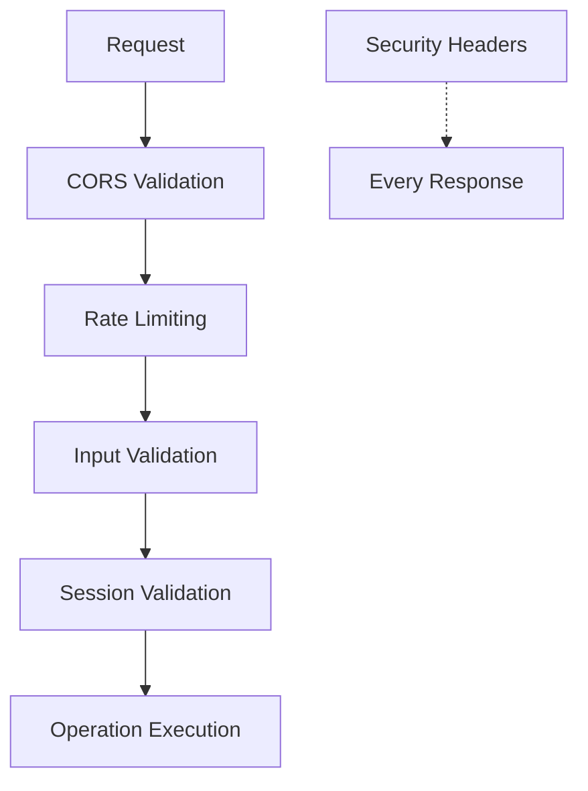
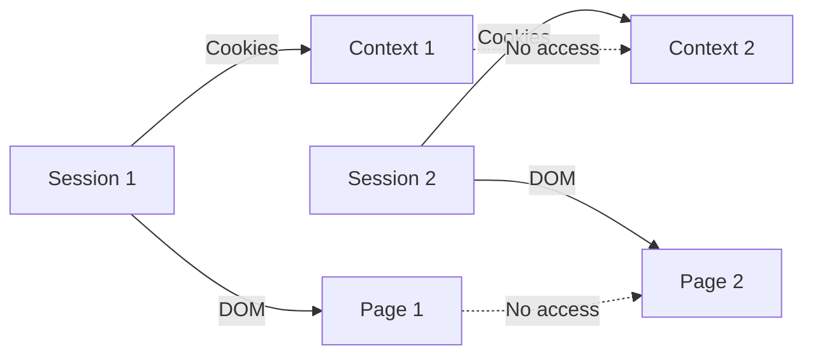

# Security

Security features, rate limiting, input validation, and best practices for safe API usage.

## Security Overview

The LLM Assistance API implements multiple security layers to protect against common threats while enabling flexible automation capabilities.

### Security Layers



## Rate Limiting

### Configuration

| Setting       | Value           |
| ------------- | --------------- |
| Window        | 60 seconds      |
| Max requests  | 100 per session |
| Key generator | Session ID      |

### Rate Limit Behavior

**Under limit:** Requests proceed normally

**Over limit:** Returns 429 Too Many Requests

```json
{
  "success": false,
  "error": "Rate limit exceeded",
  "retryAfter": 60
}
```

### Rate Limit Headers

All responses include rate limit information:

| Header                  | Description                          |
| ----------------------- | ------------------------------------ |
| `X-RateLimit-Limit`     | Maximum requests per window          |
| `X-RateLimit-Remaining` | Requests remaining in current window |
| `X-RateLimit-Reset`     | Unix timestamp when limit resets     |

### Rate Limit Bypass

Session management endpoints (`/sessions`, `/sessions/:id`) are not rate-limited to allow session recovery.

## Input Validation

### Session ID Validation

All session IDs are validated as UUIDs:

```javascript
// Session ID must match UUID format
const sessionId = req.params.id; // Automatically validated by route
```

### Selector Validation

CSS selectors are passed directly to Playwright, which validates them:

```json
{
  "selector": ".valid-selector" // ✓ Valid
}
```

**Invalid selectors return error:**

```json
{
  "success": false,
  "error": "SyntaxError: Failed to execute 'querySelector' on 'Document'"
}
```

### URL Validation

URLs are validated by Playwright's navigation:

```json
{
  "url": "https://example.com" // ✓ Valid
}
```

**Invalid URLs return error:**

```json
{
  "success": false,
  "error": "Failed to navigate: Invalid URL"
}
```

### JavaScript Code Validation

JavaScript code is executed in isolated browser context:

**Safe operations:**

```javascript
document.title; // ✓ Safe
document.querySelectorAll(".items"); // ✓ Safe
window.location.href; // ✓ Safe
```

**Restricted operations:**

- Node.js APIs (not available in browser context)
- File system access (sandboxed)
- Network requests to arbitrary URLs (CORS applies)

## Session Isolation

### Complete Isolation

Each session provides complete isolation:

**Isolated Resources:**

- Separate browser context
- Independent cookie storage
- Isolated DOM state
- Separate JavaScript execution environment
- Independent network requests

**No State Leakage:**



### Session Lifecycle Security

**Create:** New isolated context created

**Use:** Operations confined to session

**Delete:** All resources immediately freed

## Security Headers

All responses include these security headers:

| Header                              | Value           | Purpose                      |
| ----------------------------------- | --------------- | ---------------------------- |
| `X-Content-Type-Options`            | `nosniff`       | Prevent MIME type sniffing   |
| `X-Frame-Options`                   | `SAMEORIGIN`    | Prevent clickjacking attacks |
| `X-XSS-Protection`                  | `1; mode=block` | Enable browser XSS filter    |
| `X-Permitted-Cross-Domain-Policies` | `master`        | Control Adobe product access |

### Header Example

```
HTTP/1.1 200 OK
X-Content-Type-Options: nosniff
X-Frame-Options: SAMEORIGIN
X-XSS-Protection: 1; mode=block
X-Permitted-Cross-Domain-Policies: master
```

## CORS Configuration

### Default Setting

By default, CORS allows all origins:

```javascript
cors({
  origin: process.env.CORS_ORIGIN || "*",
});
```

### Production Configuration

For production, specify allowed origins:

```bash
CORS_ORIGIN=https://yourdomain.com
```

**Multiple origins:**

```bash
CORS_ORIGIN=https://domain1.com,https://domain2.com
```

### CORS Methods

Allowed HTTP methods: `GET`, `POST`, `DELETE`

### CORS Headers

Allowed headers in requests:

- `Content-Type`
- `Authorization`

Exposed headers in responses:

- `X-RateLimit-Limit`
- `X-RateLimit-Remaining`
- `X-RateLimit-Reset`

## Error Handling Security

### Error Message Sanitization

Error messages are designed to be actionable without exposing internal details:

**Good error message:**

```json
{
  "success": false,
  "error": "Could not find element with selector '.submit-button'"
}
```

**Not exposed:**

- Internal stack traces (in logs only)
- File paths
- Server configuration
- Database queries

### Error Response Format

All errors follow consistent format:

```json
{
  "success": false,
  "error": "actionable message",
  "timestamp": "2026-04-12T12:00:00.000Z"
}
```

### HTTP Status Codes

| Code | Use Case                        |
| ---- | ------------------------------- |
| 400  | Bad request, invalid parameters |
| 404  | Resource not found              |
| 408  | Operation timeout               |
| 429  | Rate limit exceeded             |
| 500  | Internal server error           |

## Authentication

### Current Implementation

No authentication required for basic usage. All authorization is session-based.

**Session-based access:**

- Session ID in URL path serves as authentication
- Each session provides isolated context
- No shared state between sessions

### Adding Authentication (Future)

To add API key authentication:

```javascript
// Example middleware
const authMiddleware = (req, res, next) => {
  const apiKey = req.headers["x-api-key"];

  if (!apiKey || !validApiKeys.includes(apiKey)) {
    return res.status(401).json({
      success: false,
      error: "Invalid API key",
    });
  }

  next();
};

// Apply to routes
app.use("/sessions", authMiddleware, sessionRoutes);
```

## Input Sanitization

### Automatic Sanitization

The API automatically sanitizes inputs through:

1. **Type validation** - JSON parsing validates structure
2. **Playwright validation** - Browser automation library validates selectors and URLs
3. **Session validation** - Session existence checked before operations

### Manual Sanitization (if needed)

For custom JavaScript code:

```javascript
// Validate code before sending
function validateJavaScript(code) {
  try {
    new Function(code); // Syntax check
    return true;
  } catch (e) {
    return false;
  }
}
```

## Resource Security

### Browser Resource Management

**Automatic cleanup:**

- Page closed on session deletion
- Context closed after page
- Browser closed after context

**Resource limits:**

- Each session uses separate browser context
- Memory usage scales with concurrent sessions
- Rate limiting prevents resource exhaustion

### File Upload Security

File uploads are handled by Playwright:

**Security measures:**

- Files served from client, not uploaded to server
- No file storage on server
- File path validation by browser automation

## Monitoring and Logging

### Request Logging

All requests logged with:

- Timestamp
- HTTP method
- Endpoint path

```
[2026-04-12T12:00:00.000Z] POST /sessions/:id/navigate
```

### Error Logging

Errors logged with full details (server-side only):

```javascript
console.error(err); // Full stack trace in logs
```

**Not exposed to clients:**

- Stack traces
- Internal paths
- Configuration details

### Audit Trail

To implement audit logging:

```javascript
// Add middleware
app.use((req, res, next) => {
  auditLog({
    timestamp: new Date().toISOString(),
    method: req.method,
    path: req.path,
    sessionId: req.params.id,
    ip: req.ip,
  });

  next();
});
```

## Best Practices

### For API Users

1. **Delete sessions after use** to free resources
2. **Handle rate limits** by checking response headers
3. **Validate selectors** before sending requests
4. **Use appropriate timeouts** for slow operations
5. **Monitor error responses** for actionable feedback

### For API Administrators

1. **Set CORS origin** in production
2. **Monitor rate limit hits** for abuse detection
3. **Review error logs** for security issues
4. **Implement authentication** if needed
5. **Set up monitoring** for resource usage

### For LLM Integration

1. **Handle errors gracefully** - use `success: false` check
2. **Respect rate limits** - implement retry with backoff
3. **Clean up sessions** - always DELETE after use
4. **Validate responses** - check data structure before use
5. **Use timeouts** - prevent hanging operations

## Security Checklist

Before deployment, verify:

- [ ] CORS origin set to specific domain in production
- [ ] Rate limiting active (default enabled)
- [ ] Security headers present on all responses
- [ ] Session validation working
- [ ] Error messages don't expose sensitive info
- [ ] Playwright browsers properly installed
- [ ] Port not exposed unnecessarily
- [ ] Logging configured appropriately
- [ ] Backup and recovery plan in place

## Related Documentation

- [[architecture/overview.md]] - Security architecture
- [[technical/configuration.md]] - CORS configuration
- [[technical/api-reference.md]] - Error codes

## Tags

`#security` `#rate-limiting` `#cors` `#input-validation` `#session-isolation` `#security-headers` `#authentication` `#error-handling` `#monitoring`
